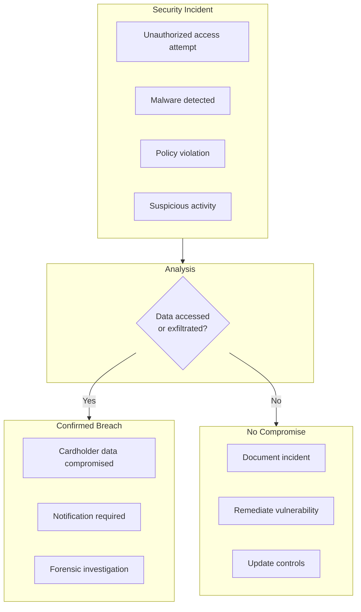
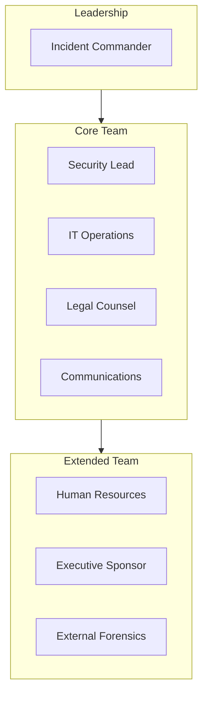

# Incident Response

> **Last Updated:** 2025-02-17
> **Status:** Complete

Security incidents and data breaches require rapid, coordinated response. For PayFac platforms handling cardholder data, incident response is not optional—it's a PCI-DSS requirement with specific notification timelines.

## Quick Reference

| Notification | Timeline | Recipient |
|--------------|----------|-----------|
| Card networks | Immediate | Visa, Mastercard |
| Acquiring bank | Immediate | Sponsor bank |
| State AG (CA) | 30 days | Attorney General |
| Affected customers | 30-60 days | Varies by state |
| PCI Forensic Investigation | If required | Within 60 days |

## Incident vs. Breach

### Definitions

| Term | Definition |
|------|------------|
| **Security Incident** | Any event that potentially compromises security |
| **Data Breach** | Confirmed unauthorized access to sensitive data |
| **Cardholder Data Breach** | Breach involving PAN, cardholder name, expiration, or service code |
| **Suspected Compromise** | Indicators suggest breach may have occurred |

## Section Contents

### [Breach Notification](./breach-notification.md)
- Notification timelines by jurisdiction
- Card network notification requirements
- Customer notification procedures

### [Quiz](./quiz.md)
- Self-assessment questions

## PCI-DSS Incident Response Requirements

PCI-DSS Requirement 12.10 mandates incident response capabilities:

| Requirement | Description |
|-------------|-------------|
| 12.10.1 | Incident response plan in place |
| 12.10.2 | Plan reviewed and tested annually |
| 12.10.3 | Designated personnel available 24/7 |
| 12.10.4 | Staff trained on response procedures |
| 12.10.5 | Alerts from security systems monitored |
| 12.10.6 | Process to modify plan based on lessons learned |

## Incident Response Team

### Team Structure

### Roles and Responsibilities

| Role | Responsibilities |
|------|------------------|
| **Incident Commander** | Overall coordination, decisions, escalation |
| **Security Lead** | Technical investigation, containment |
| **IT Operations** | System access, logs, remediation |
| **Legal Counsel** | Notification requirements, liability |
| **Communications** | Internal and external messaging |
| **HR** | Employee-related incidents |
| **Executive Sponsor** | Resource authorization, board updates |

## Incident Response Phases

```mermaid
flowchart LR
    subgraph Phase1["1. Preparation"]
        P1[Plan]
        P2[Team]
        P3[Tools]
    end

    subgraph Phase2["2. Detection"]
        D1[Identify]
        D2[Assess]
        D3[Classify]
    end

    subgraph Phase3["3. Containment"]
        C1[Isolate]
        C2[Preserve]
        C3[Limit damage]
    end

    subgraph Phase4["4. Eradication"]
        E1[Remove threat]
        E2[Patch]
        E3[Harden]
    end

    subgraph Phase5["5. Recovery"]
        R1[Restore]
        R2[Validate]
        R3[Monitor]
    end

    subgraph Phase6["6. Lessons Learned"]
        L1[Document]
        L2[Improve]
        L3[Train]
    end

    Phase1 --> Phase2
    Phase2 --> Phase3
    Phase3 --> Phase4
    Phase4 --> Phase5
    Phase5 --> Phase6
    Phase6 --> Phase1
```

### Phase Details

| Phase | Key Activities | Timeline |
|-------|----------------|----------|
| **Detection** | Alert triage, initial assessment | Minutes to hours |
| **Containment** | Isolate affected systems, preserve evidence | Hours |
| **Eradication** | Remove threat, patch vulnerabilities | Days |
| **Recovery** | Restore systems, validate security | Days to weeks |
| **Post-Incident** | Document, improve, report | Weeks |

## Incident Classification

### Severity Levels

| Level | Description | Response Time | Example |
|-------|-------------|---------------|---------|
| **Critical** | Active breach, data exfiltration | Immediate | PAN database accessed |
| **High** | Potential breach, significant risk | < 4 hours | Malware on CDE system |
| **Medium** | Security event, limited impact | < 24 hours | Failed login attempts |
| **Low** | Minor event, no immediate risk | < 72 hours | Policy violation |

### Classification Criteria

| Factor | Critical | High | Medium | Low |
|--------|----------|------|--------|-----|
| Data exposure | Confirmed | Likely | Possible | None |
| Systems affected | CDE | Connected | Non-CDE | Isolated |
| Active threat | Yes | Possibly | No | No |
| Business impact | Severe | Significant | Limited | Minimal |

## Immediate Response Checklist

### First 60 Minutes

| Step | Action | Owner |
|------|--------|-------|
| 1 | Alert incident response team | First responder |
| 2 | Activate incident commander | On-call lead |
| 3 | Initial assessment | Security team |
| 4 | Classify severity | Incident commander |
| 5 | Begin containment if critical | Security team |
| 6 | Notify legal counsel | Incident commander |
| 7 | Start incident log | All |

### Containment Actions

| Action | When to Use |
|--------|-------------|
| Isolate affected systems | Confirmed malware, active threat |
| Disable compromised accounts | Credential theft |
| Block malicious IPs | Active attack |
| Preserve logs and evidence | All incidents |
| Engage forensics | Confirmed breach |

## Evidence Preservation

### What to Preserve

| Evidence Type | How to Preserve |
|---------------|-----------------|
| System logs | Copy to secure storage |
| Network logs | Export from SIEM |
| Memory dumps | Forensic imaging |
| Disk images | Full forensic copy |
| Access logs | Export immediately |

### Chain of Custody

| Requirement | Implementation |
|-------------|----------------|
| Document collection | Who, what, when, where |
| Secure storage | Encrypted, access controlled |
| Hash verification | MD5/SHA256 of files |
| Access logging | Who accessed evidence |

## Communication During Incidents

### Internal Communication

| Audience | Information | Timing |
|----------|-------------|--------|
| IR Team | Full details | Continuous |
| Executive team | Status, impact, actions | Hourly (critical) |
| Affected departments | Need-to-know | As needed |
| All employees | General awareness | If appropriate |

### External Communication

| Audience | Information | Timing |
|----------|-------------|--------|
| Acquiring bank | Incident details | Immediate |
| Card networks | Per their requirements | Immediate |
| Regulators | Per jurisdiction | Per timeline |
| Affected customers | Per notification law | Per timeline |
| Media | Prepared statement only | If necessary |

## Related Topics

- [Breach Notification](./breach-notification.md) - Notification requirements
- [PCI Compliance](../pci-compliance/index.md) - PCI-DSS requirements
- [Merchant Monitoring](../monitoring-programs/merchant-monitoring.md) - Detection systems

## References

- [PCI DSS v4.0 Requirement 12.10](https://www.pcisecuritystandards.org/)
- [PCI Forensic Investigator Program](https://www.pcisecuritystandards.org/)
- [NIST Incident Response Guide](https://nvlpubs.nist.gov/nistpubs/SpecialPublications/NIST.SP.800-61r2.pdf)
