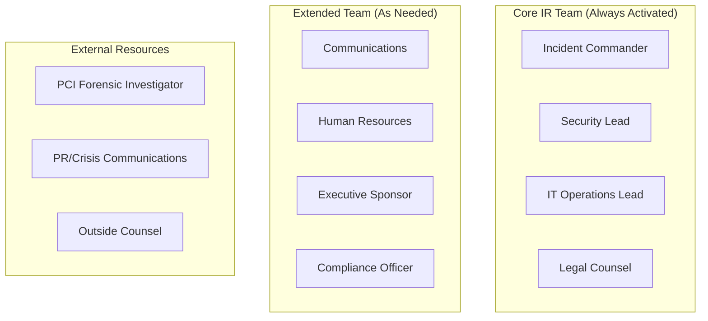

# Incident Response Quiz

> **Last Updated:** 2025-02-17
> **Status:** Complete

Test your understanding of incident response with these self-assessment questions.

## Incident Classification

### Question 1: Incident vs. Breach

**What is the difference between a security incident and a confirmed breach?**

View Answer

**Security Incident:**
- Any event that potentially compromises security
- May or may not involve data access
- Requires investigation to determine scope
- Examples: malware detection, unauthorized access attempt, policy violation

**Confirmed Breach:**
- Unauthorized access to sensitive data is confirmed
- Data has been or likely was accessed or exfiltrated
- Triggers notification requirements
- Examples: database with PANs accessed, cardholder data exported

**Key Distinction:**

| Factor | Incident | Breach |
|--------|----------|--------|
| Data accessed | Unknown/No | Confirmed Yes |
| Notification required | Not automatically | Yes, per laws |
| Forensics required | Maybe | Usually yes |
| Regulatory reporting | Depends | Required |

**Why It Matters:**
- Not every incident is a breach
- Breach triggers specific legal obligations
- Must investigate to determine which
- Document decision either way

### Question 2: Immediate Steps

**A potential data breach is detected. What are the immediate steps that must be taken?**

View Answer

**Immediate Steps (First 60 Minutes):**

| Step | Action | Owner |
|------|--------|-------|
| 1 | Alert incident response team | First responder |
| 2 | Activate incident commander | On-call lead |
| 3 | Preserve evidence | Security team |
| 4 | Initial assessment | Security team |
| 5 | Classify severity | Incident commander |
| 6 | Begin containment if critical | Security team |
| 7 | Notify legal counsel | Incident commander |
| 8 | Start incident log | All |

**Containment Actions:**
- Isolate affected systems
- Disable compromised accounts
- Block malicious IPs/access
- Preserve logs before rotation

**Do NOT:**
- Reboot systems (destroys memory evidence)
- Delete logs or files
- Notify customers yet (investigation first)
- Make public statements
- Speculate about scope

**Who to Notify Immediately:**
- Acquiring bank
- Legal counsel
- Executive sponsor (if critical)

### Question 3: Notification Timelines

**What are the notification timelines for a confirmed breach? Who must be notified?**

View Answer

**Notification Timeline:**

| Recipient | Timeline | Purpose |
|-----------|----------|---------|
| Acquiring bank | Immediately (hours) | Required by agreement |
| Card networks | Immediately (hours) | Account data compromise |
| Legal counsel | Immediately | Guidance on obligations |
| Executive team | Same day | Decision authority |
| State AG (varies) | 15-60 days | Regulatory requirement |
| Affected customers | 30-60 days | Per state law |
| Credit bureaus | With customer notice | If > 5,000 affected |

**Card Network Specifics:**

| Network | Key Requirements |
|---------|------------------|
| Visa | 24 hours, contain within 60 business days |
| Mastercard | Immediately, provide account list ASAP |

**State Law Examples:**

| State | Timeline | Notes |
|-------|----------|-------|
| California | 30 days (residents), 15 days (AG) | SB 446 effective 2026 |
| Oklahoma | 60 days | Expanded data types |
| Most states | "Without unreasonable delay" | Often interpreted as 30-60 days |

**GDPR (if applicable):**
- 72 hours to supervisory authority
- "Without undue delay" to individuals

## Scenario Questions

### Question 4: Accidental Data Exposure

**Scenario:** A developer accidentally logs cardholder data to application logs. The logs are stored in a cloud service. Is this a breach? What steps must be taken?

View Answer

**Assessment:**

**Is this a breach?**
- **Potentially yes** - depends on who had access to logs
- Cardholder data was stored inappropriately (PCI violation)
- If logs were accessible beyond authorized personnel, it's a breach

**Investigation Questions:**
1. What data was logged? (Full PAN, partial, other?)
2. How long were logs retained?
3. Who had access to log storage?
4. Is log storage encrypted?
5. Are there access logs for the log storage?
6. Any evidence of unauthorized access?

**Required Steps:**

**Immediate (Hours):**
1. Stop logging sensitive data
2. Preserve existing logs as evidence
3. Assess who had access
4. Notify legal counsel
5. Document the incident

**Short-Term (Days):**
1. Determine if unauthorized access occurred
2. If breach confirmed, notify acquiring bank
3. Engage forensics if needed
4. Prepare notification materials

**Remediation:**
1. Implement log masking/filtering
2. Review all logging for PCI data
3. Train developers on data handling
4. Update secure coding standards

**PCI Implications:**
- Storing PAN in logs violates Requirement 3
- May trigger non-compliance notification
- Document remediation for next assessment

### Question 5: Incident Response Team Structure

**How should an incident response team be structured for a payment facilitator?**

View Answer

**Recommended Team Structure:**

**Role Responsibilities:**

| Role | Primary Responsibilities |
|------|--------------------------|
| **Incident Commander** | Overall coordination, escalation decisions, resource allocation |
| **Security Lead** | Technical investigation, containment, evidence preservation |
| **IT Operations** | System access, log retrieval, remediation execution |
| **Legal Counsel** | Notification requirements, liability assessment, regulatory guidance |
| **Communications** | Internal/external messaging, customer notification drafting |
| **Compliance Officer** | Regulatory reporting, card network notifications |
| **Executive Sponsor** | Resource authorization, board communication |

**PayFac-Specific Additions:**

| Role | Responsibility |
|------|---------------|
| **Merchant Operations** | Sub-merchant communication and support |
| **Sponsor Bank Liaison** | Coordinate with acquiring bank |
| **Risk Team** | Assess merchant portfolio impact |

**Team Activation Criteria:**

| Severity | Team Activated |
|----------|----------------|
| Critical | Full team + external |
| High | Core team + legal |
| Medium | Security + IT + on-call |
| Low | Security lead only |

**24/7 Availability:**
- On-call rotation for core team
- Contact list maintained and tested
- Escalation procedures documented

### Question 6: Post-Breach Actions

**After a breach is contained and notifications sent, what ongoing actions are required?**

View Answer

**Post-Breach Actions:**

**Immediate Post-Containment:**

| Action | Timeline | Owner |
|--------|----------|-------|
| Complete forensic report | 2-4 weeks | Forensics team |
| Document lessons learned | 1 week post-close | IR team |
| Update incident response plan | 2 weeks | Security |
| Remediate vulnerabilities | ASAP | IT/Security |

**Customer Support:**

| Action | Description |
|--------|-------------|
| Inquiry hotline | Dedicated line for affected customers |
| FAQ document | Common questions answered |
| Credit monitoring | If offered, manage enrollment |
| Follow-up communications | Updates as investigation concludes |

**Regulatory Follow-Up:**

| Action | Timeline |
|--------|----------|
| State AG follow-up | As required |
| Card network updates | As requested |
| PCI assessor notification | At next assessment |
| Insurance claims | Per policy |

**Technical Remediation:**

| Action | Purpose |
|--------|---------|
| Patch vulnerabilities | Prevent recurrence |
| Enhance monitoring | Detect similar attacks |
| Update access controls | Limit exposure |
| Security testing | Validate fixes |

**Process Improvements:**

| Action | Purpose |
|--------|---------|
| Tabletop exercise | Test updated plan |
| Training refresh | Apply lessons learned |
| Control updates | Based on root cause |
| Policy updates | Address gaps identified |

**Documentation to Retain:**

| Document | Retention |
|----------|-----------|
| Incident report | 7+ years |
| Forensic report | 7+ years |
| Notification copies | 7+ years |
| Remediation evidence | 5+ years |

## Summary

After completing this quiz, you should understand:

- [ ] Difference between security incident and confirmed breach
- [ ] Immediate steps upon detecting potential breach
- [ ] Notification timelines for different parties
- [ ] How to assess if an event constitutes a breach
- [ ] Incident response team structure
- [ ] Post-breach ongoing obligations

## Related Topics

- [Incident Response Overview](./index.md) - Response procedures
- [Breach Notification](./breach-notification.md) - Notification requirements
- [PCI Compliance](../pci-compliance/index.md) - PCI requirements
