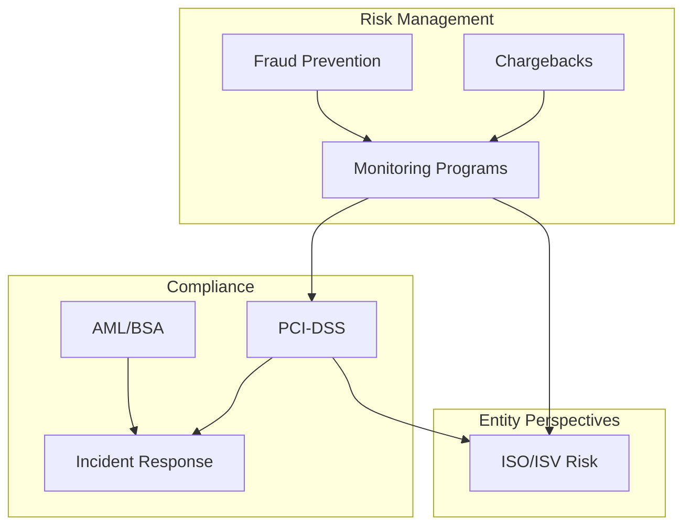

# Risk & Compliance

> **Last Updated:** 2025-02-17
> **Status:** Complete

This is where payment companies succeed or fail. A single merchant with uncontrolled chargebacks can cost hundreds of thousands of dollars. A PCI breach can end a business. This module covers the critical risk and compliance frameworks that protect PayFac platforms.

## Quick Reference

| Area | Key Threshold | Consequence |
|------|---------------|-------------|
| Chargebacks | 1% ratio | Network monitoring programs, fines |
| Fraud | 1% fraud rate | VFMP/EFM entry, potential termination |
| PCI-DSS | Level 1 SP | Annual ROC, quarterly scans |
| AML/BSA | $5K SAR threshold | FinCEN reporting required |
| Breach | 72 hours | Notification deadline |

## Module Structure

## Learning Objectives

After completing this module, you will be able to:

### Chargeback Management
- Navigate a chargeback from receipt through arbitration
- Identify reason codes and evidence requirements for representment
- Calculate and manage chargeback ratios to avoid monitoring programs

### Fraud Prevention
- Recognize common fraud patterns (card testing, friendly fraud, ATO)
- Implement fraud detection tools (AVS, CVV, 3D Secure, ML scoring)
- Understand liability shift with 3D Secure authentication

### Network Monitoring
- Explain VDMP, VFMP, ECP, EFM program thresholds and consequences
- Design merchant monitoring systems with appropriate alerts
- Manage reserves as a risk mitigation tool

### PCI-DSS Compliance
- Describe all 12 PCI-DSS requirements at a high level
- Reduce PCI scope through tokenization and segmentation
- Understand compliance levels and validation requirements

### AML/BSA Compliance
- Identify the three stages of money laundering
- Recognize SAR-triggering transaction patterns
- Implement transaction monitoring for suspicious activity

### Incident Response
- Execute breach notification within required timelines
- Structure an incident response team for payment platforms
- Conduct post-incident remediation

## Sections

### [1. Chargeback Management](./chargebacks/index.md)

The complete guide to dispute management, from initiation through arbitration:

- **[Chargeback Lifecycle](./chargebacks/lifecycle.md)** - The dispute process from start to finish
- **[Reason Codes](./chargebacks/reason-codes.md)** - Visa and Mastercard code reference
- **[Representment](./chargebacks/representment.md)** - Building winning dispute responses
- **[Quiz](./chargebacks/quiz.md)** - Test your understanding

### [2. Fraud Prevention](./fraud-prevention/index.md)

Detection and prevention strategies for payment fraud:

- **[Fraud Patterns](./fraud-prevention/fraud-patterns.md)** - Card testing, friendly fraud, ATO
- **[Detection Tools](./fraud-prevention/detection-tools.md)** - AVS, CVV, device fingerprinting, ML
- **[3D Secure](./fraud-prevention/3d-secure.md)** - 3DS2, liability shift, SCA requirements
- **[Quiz](./fraud-prevention/quiz.md)** - Test your understanding

### [3. Network Monitoring](./monitoring-programs/index.md)

Card network compliance programs and merchant health:

- **[Network Programs](./monitoring-programs/network-programs.md)** - VDMP, VFMP, ECP, EFM, MATCH
- **[Merchant Monitoring](./monitoring-programs/merchant-monitoring.md)** - Dashboards and alert systems
- **[Reserve Management](./monitoring-programs/reserve-management.md)** - Rolling, fixed, and capped reserves
- **[Quiz](./monitoring-programs/quiz.md)** - Test your understanding

### [4. PCI-DSS Compliance](./pci-compliance/index.md)

Payment Card Industry Data Security Standard requirements:

- **[PCI Requirements](./pci-compliance/requirements.md)** - The 12 requirements overview
- **[Scope Management](./pci-compliance/scope-management.md)** - CDE, segmentation, scope reduction
- **[Tokenization](./pci-compliance/tokenization.md)** - Token strategies and P2PE
- **[Quiz](./pci-compliance/quiz.md)** - Test your understanding

### [5. AML & BSA](./aml-bsa/index.md)

Anti-Money Laundering and Bank Secrecy Act compliance:

- **[Money Laundering](./aml-bsa/money-laundering.md)** - Stages, patterns, and red flags
- **[SAR Reporting](./aml-bsa/sar-reporting.md)** - Filing requirements and thresholds
- **[Transaction Monitoring](./aml-bsa/transaction-monitoring.md)** - AML monitoring systems
- **[Quiz](./aml-bsa/quiz.md)** - Test your understanding

### [6. Incident Response](./incident-response/index.md)

Security incident and data breach management:

- **[Breach Notification](./incident-response/breach-notification.md)** - Timelines and procedures
- **[Quiz](./incident-response/quiz.md)** - Test your understanding

### [7. ISO & ISV Perspectives](./iso-isv-perspectives/index.md)

Risk and compliance responsibilities for ISOs and ISVs compared to PayFacs:

- **[Liability Structures](./iso-isv-perspectives/liability-structures.md)** - Chargeback, fraud, and reserve liability by entity
- **[Compliance Obligations](./iso-isv-perspectives/compliance-obligations.md)** - PCI, AML, network registration by model
- **[Network Program Applicability](./iso-isv-perspectives/network-program-applicability.md)** - VAMP, ECP, MATCH by entity
- **[Portfolio Risk Management](./iso-isv-perspectives/portfolio-risk-management.md)** - Sub-agent and vertical compliance
- **[Quiz](./iso-isv-perspectives/quiz.md)** - Test your understanding

### [8. Study Guide](./study-guide/topics.md)

Learning resources and self-assessment:

- **[Topics](./study-guide/topics.md)** - Topics covered in this module
- **[Questions](./study-guide/questions.md)** - 41 self-assessment questions
- **[Resources](./study-guide/resources.md)** - Reading materials and references

## Key Metrics to Track

| Metric | Target | Critical Threshold |
|--------|--------|-------------------|
| Chargeback Ratio | < 0.5% | 1.0% (program entry) |
| Fraud Rate | < 0.5% | 1.0% (program entry) |
| Dispute Response Time | < 24 hours | Before deadline |
| PCI Compliance | 100% | Any gap = non-compliant |
| SAR Filing Time | < 30 days | Regulatory requirement |

## PayFac-Specific Considerations

As a Payment Facilitator, you face unique risk challenges:

1. **First-Line Liability** - PayFac absorbs sub-merchant chargebacks before the sponsor bank
2. **Aggregated Reporting** - Your chargeback ratio includes all sub-merchants
3. **Reserve Management** - You hold reserves against sub-merchant risk
4. **Sub-Merchant Termination** - You must terminate merchants who exceed thresholds
5. **Sponsor Bank Escalation** - Excessive risk triggers sponsor bank intervention

## Related Modules

- **[Payment Ecosystem](/ecosystem/)** - Foundation for understanding transaction flows
- **[Merchant Onboarding](/onboarding/)** - Underwriting that prevents risk, ongoing monitoring
- **Transaction Processing** (coming soon) - Transaction data that enables monitoring
- **Platform Architecture** (coming soon) - Architecture supporting compliance

## References

- [Visa Core Rules and Product Program Guide](https://usa.visa.com/dam/VCOM/download/about-visa/visa-rules-public.pdf)
- [Mastercard Rules Manual](https://www.mastercard.us/content/dam/public/mastercardcom/na/global-site/documents/mastercard-rules.pdf)
- [PCI Security Standards Council](https://www.pcisecuritystandards.org/)
- [FinCEN - Financial Crimes Enforcement Network](https://www.fincen.gov/)
- [FFIEC BSA/AML Examination Manual](https://bsaaml.ffiec.gov/manual)
