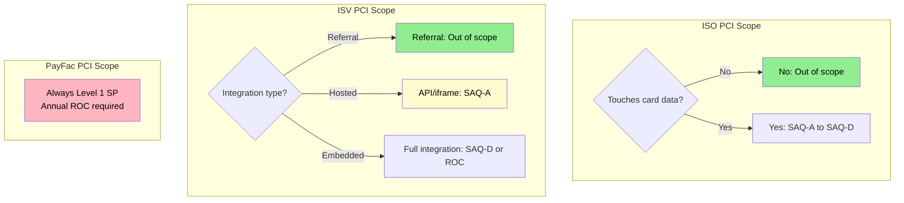
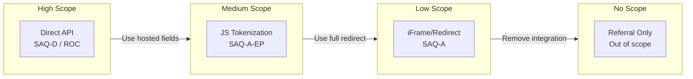
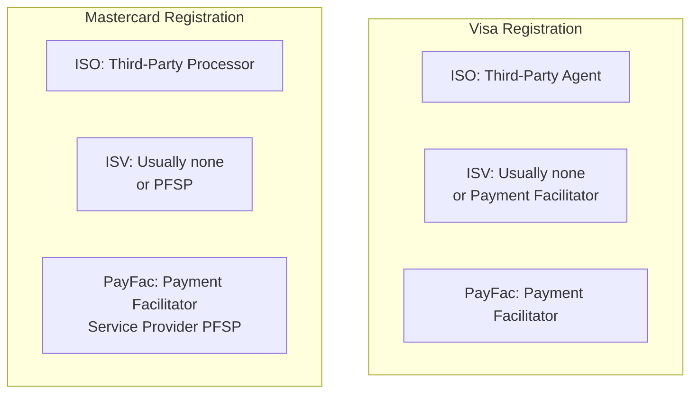

# Compliance Obligations

> **Last Updated:** 2025-02-17
> **Status:** Complete

Compliance requirements vary dramatically across payment entity types. This comprehensive guide maps specific obligations—including [PCI-DSS](/glossary#pci-dss), [AML/BSA](/glossary#aml), network registration, and money transmitter licensing—to ISOs, ISVs, and PayFacs.

## Quick Reference

| Requirement | ISO | ISV (Non-PayFac) | PayFac |
|-------------|-----|------------------|--------|
| **PCI-DSS** | SAQ or none | SAQ-A to SAQ-D | Level 1 SP (ROC) |
| **AML/BSA Program** | No | No | Yes (MSB) |
| **FinCEN Registration** | No | No | Yes (MSB) |
| **Network Registration** | Third-Party Agent | Usually none | PayFac registration |
| **MTL (Money Transmitter)** | No | Rarely | Often required |
| **Sponsor Bank Required** | Yes | Via processor | Yes |

## PCI-DSS Scope by Entity

### Understanding PCI Scope Triggers

PCI scope is triggered by handling cardholder data. Different entity types have vastly different exposure:

### ISO PCI Requirements

**What PCI compliance do ISOs need?** ISO PCI scope depends entirely on whether they handle cardholder data:

| ISO Type | Card Data Handling | PCI Requirement |
|----------|-------------------|-----------------|
| **Referral-only** | None | Out of scope |
| **Equipment provider** | May see encrypted data | SAQ-B or SAQ-P2PE |
| **Call center operations** | Hears card numbers | SAQ-C-VT or SAQ-D |
| **Web portal with gateway** | Redirects to processor | SAQ-A |

**Most ISOs Structure for Minimal Scope:**
- Use processor's PCI-compliant infrastructure
- Never handle cardholder data directly
- Terminals encrypt at point of entry (P2PE)
- Result: Out of PCI scope or SAQ-A only

### ISV PCI Requirements

ISV PCI scope depends on integration architecture:

| Integration Model | PCI Requirement | Scope Driver |
|-------------------|-----------------|--------------|
| **Referral only** | None | No data handling |
| **iFrame/redirect** | SAQ-A | Redirects to processor |
| **JavaScript tokenization** | SAQ-A-EP | Controls page, JS collects |
| **API integration (direct)** | SAQ-D or Level 1 | Handles card data |
| **Full PayFac** | Level 1 Service Provider | Stores/processes data |

:::warning PCI 4.0 Requirements (March 2025)
PCI DSS 4.0 introduces stricter requirements for:
- JavaScript security (6.4.3) - affects ISVs using JS tokenization
- Content Security Policy headers
- Subresource integrity verification
:::

**ISV Scope Reduction Strategies:**

### PayFac PCI Requirements

PayFacs are **always** Level 1 Service Providers regardless of transaction volume:

| Requirement | Frequency | Description |
|-------------|-----------|-------------|
| **Report on Compliance (ROC)** | Annual | Full audit by QSA |
| **Quarterly ASV Scans** | Quarterly | External vulnerability scans |
| **Annual Penetration Test** | Annual | Internal and external |
| **Attestation of Compliance (AOC)** | Annual | Formal compliance statement |

**PayFac PCI Responsibilities:**

| Area | Requirement |
|------|-------------|
| **Sub-merchant compliance** | Ensure sub-merchants meet appropriate SAQ |
| **Data segmentation** | Isolate sub-merchant data |
| **Encryption** | Encrypt all card data in transit and at rest |
| **Access controls** | Limit access to cardholder data |
| **Monitoring** | Log and monitor all access to card data |

## AML/BSA Applicability

### Money Services Business (MSB) Status

AML/BSA requirements apply to Money Services Businesses. Determination by entity:

| Entity | MSB Status | Reasoning |
|--------|------------|-----------|
| **ISO (Standard)** | No | Does not move or hold funds |
| **ISO (Holds funds)** | Possibly | Fund holding may trigger MSB |
| **ISV (Referral)** | No | Not a payment party |
| **ISV (PFaaS)** | No | PFaaS provider is MSB |
| **PayFac** | Yes | Holds and distributes funds |

### ISO AML Considerations

**Do ISOs need AML programs?** Standard ISOs are **not** subject to AML/BSA because they:

- Do not receive or hold merchant funds
- Do not transmit money on behalf of merchants
- Act only as sales intermediaries

**Exceptions that may trigger MSB status:**
- ISO offers payment processing under own brand with fund holding
- ISO provides settlement services
- ISO operates prepaid card programs

### ISV AML Considerations

Most ISVs avoid AML/BSA obligations:

| Model | AML Obligation | Why |
|-------|----------------|-----|
| **Referral** | None | Not payment party |
| **API Integration** | None | Processor handles funds |
| **PFaaS** | None | Provider is MSB |
| **PayFac** | Full | ISV becomes MSB |

### PayFac AML Requirements

PayFacs must maintain comprehensive AML programs:

| Requirement | Implementation |
|-------------|----------------|
| **Written AML policy** | Documented procedures |
| **Designated compliance officer** | Named individual with authority |
| **Training program** | Annual AML training for staff |
| **Transaction monitoring** | Automated suspicious activity detection |
| **SAR filing** | File within 30 days of detection |
| **CTR filing** | Report cash transactions >$10K |
| **Recordkeeping** | 5-year retention minimum |

See [AML/BSA Overview](../aml-bsa/index.md) for detailed requirements.

## Network Registration Requirements

### Card Network Registration by Entity

### ISO Network Registration

ISOs register as **Third-Party Agents (TPA)** with card networks:

| Network | Registration Type | Requirements |
|---------|-------------------|--------------|
| **Visa** | Third-Party Agent | Sponsor bank registration, annual renewal |
| **Mastercard** | Third-Party Processor | Similar, different terminology |

:::info Network Terminology
Visa and Mastercard use different terms for the same concept:
- **Visa:** Third-Party Agent (TPA)
- **Mastercard:** Third-Party Processor (TPP)

Both refer to ISOs that refer merchants to acquiring banks. The registration process, requirements, and principal background checks are comparable across networks.
:::

**ISO Registration Process:**

1. Sponsor bank files registration with networks
2. ISO principals undergo background checks
3. ISO listed in network's agent registry
4. Annual renewal required
5. Changes must be reported within 30 days

**Registration Fees:**
- Visa: $1,000-$5,000 annually
- Mastercard: Similar range
- Varies by sponsor bank and ISO tier

### ISV Network Registration

Most ISVs do not require direct network registration:

| ISV Model | Registration Required? | Notes |
|-----------|------------------------|-------|
| **Referral** | No | Not a payment participant |
| **API Integration** | No | Processor holds registration |
| **PFaaS** | No | Provider holds registration |
| **PayFac** | Yes | Full PayFac registration |

### PayFac Network Registration

PayFacs must register directly with card networks:

| Network | Registration | Fee | Requirements |
|---------|--------------|-----|--------------|
| **Visa** | Payment Facilitator | $5,000+ annually | Sponsor agreement, compliance audit |
| **Mastercard** | PFSP | Similar | Sponsor agreement, compliance audit |
| **Discover** | Payment Facilitator | Varies | Similar requirements |
| **Amex** | OptBlue or direct | Varies | Additional Amex agreement |

## Money Transmitter Licensing

### MTL Requirements by Entity

| Entity | MTL Required? | Reasoning |
|--------|---------------|-----------|
| **ISO (Standard)** | No | No fund transmission |
| **ISO (Holding funds)** | Possibly | State-by-state analysis |
| **ISV (Referral)** | No | No fund transmission |
| **ISV (PFaaS)** | No | Provider handles transmission |
| **PayFac** | Often | Holds and transmits sub-merchant funds |

### PayFac MTL Considerations

PayFacs often require money transmitter licenses because they:

1. Receive funds from card networks
2. Hold funds temporarily
3. Transmit funds to sub-merchants

**State-by-State Complexity:**

| State | MTL Approach | Notes |
|-------|--------------|-------|
| **California** | Required for most PayFacs | Strict interpretation |
| **New York** | BitLicense + MTL | Complex requirements |
| **Texas** | May be exempt | Agent of payee exemption |
| **Montana** | No MTL requirement | No state license needed |

**Common Exemptions Used:**
- Agent of payee exemption (varies by state)
- Bank partnership (PayFac as bank agent)
- Payment processor exemption (limited states)

:::tip Sponsor Bank Partnership
Many PayFacs operate under their sponsor bank's licenses, avoiding the need for 50+ state MTLs. This requires careful legal structuring.
:::

## Compliance Comparison Summary

### ISO Compliance Burden

**Minimal Compliance Requirements:**
- ✅ Sponsor bank agreement
- ✅ Network registration (Third-Party Agent)
- ✅ Background checks for principals
- ⚠️ PCI scope (usually minimal or none)
- ❌ No AML program required
- ❌ No MTL required
- ❌ No SAR filing obligations

**Why ISOs Have Light Compliance:**
- Don't handle cardholder data (typically)
- Don't hold or move funds
- Act as sales/service intermediaries only
- Bank/processor bears compliance responsibility

### ISV Compliance Burden (Non-PayFac)

**Variable Compliance Requirements:**
- ⚠️ PCI scope depends on integration
- ⚠️ Processor/PFaaS provider handles most compliance
- ❌ No AML program (unless PayFac)
- ❌ No MTL (unless PayFac)
- ❌ No network registration (unless PayFac)

**Compliance Shifts to Provider:**
- Payment processor handles fund movement
- PFaaS provider handles merchant compliance
- ISV focuses on software compliance (HIPAA, SOC 2, etc.)

### PayFac Compliance Burden

**Comprehensive Compliance Requirements:**
- ✅ Level 1 PCI Service Provider (annual ROC)
- ✅ Full AML/BSA program with SAR filing
- ✅ Network registration (all networks used)
- ✅ Sponsor bank agreement
- ⚠️ MTL licensing (state-by-state analysis)
- ✅ Sub-merchant compliance monitoring
- ✅ Transaction monitoring
- ✅ Ongoing compliance audits

## Self-Assessment Questions

1. Why are most ISOs out of PCI scope entirely?
2. How does an ISV's integration model affect their PCI requirements?
3. Why don't standard ISOs need AML programs?
4. What triggers the need for PayFac network registration?
5. How can PayFacs avoid obtaining 50+ state money transmitter licenses?

## Related Topics

- [Liability Structures](./liability-structures.md) - Chargeback and fraud liability by entity
- [Network Program Applicability](./network-program-applicability.md) - VAMP, ECP by entity
- [PCI-DSS Requirements](../pci-compliance/requirements.md) - Detailed PCI requirements
- [PCI Scope Management](../pci-compliance/scope-management.md) - Reducing PCI scope
- [AML/BSA Overview](../aml-bsa/index.md) - AML program requirements
- [ISOs in the Ecosystem](/ecosystem/industry-players/isos) - ISO business model
- [ISVs in the Ecosystem](/ecosystem/industry-players/isvs) - ISV integration approaches
- [PayFac Model](/ecosystem/payfac-model/overview) - Payment Facilitator fundamentals
- [Glossary](/glossary) - PCI-DSS, AML, MSB definitions

## References

- [PCI SSC](https://www.pcisecuritystandards.org/) - PCI compliance by entity type
- [FinCEN MSB Registration](https://www.fincen.gov/msb-registrant-search) - MSB requirements
- [Visa Core Rules](https://usa.visa.com/dam/VCOM/download/about-visa/visa-rules-public.pdf) - Registration requirements
- [State Money Transmitter Laws](https://www.csbs.org/) - CSBS state-by-state guide
