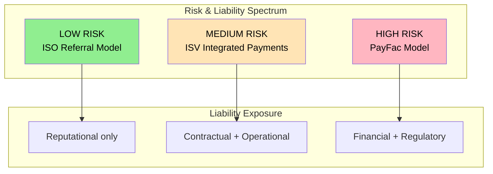
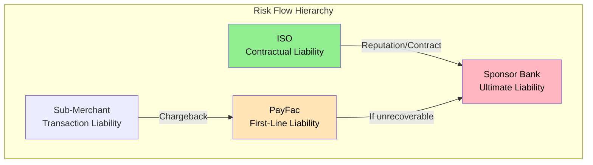

# ISO & ISV Risk Perspectives

> **Last Updated:** 2025-02-17
> **Status:** Complete

This section examines how risk and compliance responsibilities differ across payment distribution models. While the previous sections focus primarily on [Payment Facilitator (PayFac)](/ecosystem/payfac-model/overview) obligations, [Independent Sales Organizations (ISOs)](/ecosystem/industry-players/isos) and [Independent Software Vendors (ISVs)](/ecosystem/industry-players/isvs) have distinct risk profiles and compliance requirements.

## Quick Reference

| Aspect | ISO | ISV | PayFac |
|--------|-----|-----|--------|
| **Chargeback Liability** | None (pass-through) | Varies by model | Full first-line |
| **PCI Scope** | Minimal to none | Varies by integration | Full Level 1 SP |
| **AML/BSA** | Generally not applicable | Generally not applicable | Full MSB obligations |
| **Network Registration** | Third-Party Agent | Usually none | PayFac registration |
| **Reserve Requirements** | None from merchants | None from users | Required from sub-merchants |
| **MATCH Listing** | Rare (principal violations) | Rare | Common (merchant issues) |

## The Risk Spectrum

Understanding where each entity sits on the risk and responsibility spectrum is essential for platform design decisions.

## Why This Matters

Understanding the ISO and ISV perspective is critical for:

1. **Platform Architecture Decisions** - Choosing between ISO partnerships, ISV integrations, or full PayFac builds affects risk exposure
2. **Partnership Structures** - Negotiating appropriate liability allocation in partner agreements
3. **Sub-Agent Management** - ISOs working with your PayFac need clear risk boundaries
4. **Vertical Expansion** - ISVs integrating payments must understand compliance scope
5. **Risk Assessment** - Evaluating partners requires understanding their risk profiles

## Entity Definitions

### ISO (Independent Sales Organization)

**What is an ISO?** An ISO is a third-party sales and distribution partner that refers merchants to [acquirers](/glossary#acquirer) or processors. ISOs:

- **Do NOT** process transactions
- **Do NOT** hold merchant funds (typically)
- **Do NOT** take chargeback liability
- **DO** provide merchant acquisition, onboarding support, and ongoing service
- **DO** earn residual income on merchant volume

**Risk Profile:** Lowest in the payment chain. Primary risks are reputational and contractual.

See [ISOs in the Ecosystem](/ecosystem/industry-players/isos) for business model details.

### ISV (Independent Software Vendor)

An ISV is a software company that may embed payments into their platform. ISVs operate across a spectrum:

| Integration Level | Risk Level | Example |
|-------------------|------------|---------|
| **Referral only** | Very low | Software recommends payment provider |
| **API integration** | Low-medium | Software connects to payment gateway |
| **Embedded (PFaaS)** | Medium | Software uses PayFac-as-a-Service |
| **Full PayFac** | High | Software becomes registered PayFac |

**Risk Profile:** Varies dramatically by integration model. Referral ISVs have minimal risk; PayFac ISVs have full liability.

See [ISVs in the Ecosystem](/ecosystem/industry-players/isvs) for business model details.

### PayFac (Payment Facilitator)

For comparison, a PayFac is a master merchant that onboards sub-merchants under its own merchant account. PayFacs:

- **DO** take first-line chargeback liability
- **DO** hold and distribute sub-merchant funds
- **DO** perform underwriting and KYC/KYB
- **DO** maintain compliance with PCI, AML, network rules
- **DO** register with card networks

**Risk Profile:** Highest in the distribution chain. Full financial, regulatory, and operational liability.

## Comparison Matrix

### Regulatory and Compliance Obligations

| Requirement | ISO | ISV (Non-PayFac) | PayFac |
|-------------|-----|------------------|--------|
| **Card Network Registration** | Third-Party Agent | Optional (gateway) | PayFac registration |
| **PCI-DSS Compliance** | SAQ or none | SAQ-A to Level 1 | Level 1 Service Provider |
| **AML/BSA Program** | No | No | Yes (MSB) |
| **Money Transmitter License** | No | Rarely | Often required |
| **Sponsor Bank Agreement** | Yes | Via PayFac/processor | Yes |

### Financial Risk Exposure

| Risk Type | ISO | ISV (Non-PayFac) | PayFac |
|-----------|-----|------------------|--------|
| **Chargeback Losses** | None | None | First-line liability |
| **Fraud Losses** | None | Contractual exposure | Direct exposure |
| **Reserve Obligations** | None | None | Required |
| **Network Fines** | Indirect (sponsor) | Indirect | Direct |
| **MATCH Listing Risk** | Rare | Rare | Common |

### Operational Requirements

| Function | ISO | ISV (Non-PayFac) | PayFac |
|----------|-----|------------------|--------|
| **Merchant Underwriting** | Assist (bank decides) | None | Full responsibility |
| **Transaction Monitoring** | Limited | Limited | Comprehensive |
| **Chargeback Management** | Support merchant | None | Full management |
| **SAR Filing** | No | No | Yes |
| **Merchant Termination** | Recommend | N/A | Execute |

## Sections in This Category

### [Liability Structures](./liability-structures.md)

Deep dive into how chargeback, fraud, and regulatory liability flows across entity types:

- Chargeback liability by model
- Reserve requirement differences
- Sub-agent liability cascading
- Contractual risk allocation

### [Compliance Obligations](./compliance-obligations.md)

Compliance requirements by entity type:

- PCI-DSS scope by model
- AML/BSA applicability
- Network registration requirements
- Money transmitter considerations

### [Network Program Applicability](./network-program-applicability.md)

How network monitoring programs apply to each entity:

- VAMP applicability for ISOs
- ECP/EFM applicability for ISVs
- MATCH list implications
- Program responsibility allocation

### [Portfolio Risk Management](./portfolio-risk-management.md)

Risk management specific to ISO and ISV portfolios:

- Sub-agent due diligence
- Vertical-specific compliance
- KYC/KYB delegation
- Ongoing monitoring requirements

### [Quiz](./quiz.md)

Self-assessment questions covering ISO and ISV risk concepts.

## Key Concepts

### Risk Flows Upward

In the payment hierarchy, risk ultimately flows upward to the sponsor bank:

### Liability Allocation by Agreement

Risk distribution is defined by contracts at each level:

| Agreement Level | Parties | Key Risk Terms |
|-----------------|---------|----------------|
| **Sponsor Agreement** | Bank ↔ PayFac | Reserve requirements, chargeback limits, termination thresholds |
| **ISO Agreement** | PayFac ↔ ISO | Merchant quality standards, prohibited MCCs, liability limits |
| **Merchant Agreement** | PayFac ↔ Merchant | Chargeback responsibility, refund policies, prohibited activities |

### The "Know Your Partner" Principle

Each entity must perform due diligence appropriate to their risk exposure:

| Entity | Due Diligence Focus |
|--------|---------------------|
| **PayFac** | Full KYC/KYB on sub-merchants |
| **ISO** | Merchant qualification screening |
| **ISV** | User verification for embedded payments |
| **Sponsor Bank** | PayFac and ISO financial stability |

## Related Topics

- [ISOs in the Ecosystem](/ecosystem/industry-players/isos) - ISO business model and structure
- [ISVs in the Ecosystem](/ecosystem/industry-players/isvs) - ISV payment integration models
- [PayFac Model Overview](/ecosystem/payfac-model/overview) - Payment Facilitator fundamentals
- [Four-Party Model](/ecosystem/fundamentals/four-party-model/index.md) - Understanding the payment flow
- [Chargeback Management](../chargebacks/index.md) - PayFac chargeback handling
- [PCI Compliance](../pci-compliance/index.md) - PCI scope management
- [AML/BSA Requirements](../aml-bsa/index.md) - Anti-money laundering compliance
- [Network Monitoring Programs](../monitoring-programs/network-programs.md) - VAMP, ECP, MATCH
- [Glossary](/glossary) - Payment industry terminology

## References

- [Visa Core Rules](https://usa.visa.com/dam/VCOM/download/about-visa/visa-rules-public.pdf) - Third-party agent requirements
- [Mastercard Rules](https://www.mastercard.us/content/dam/public/mastercardcom/na/global-site/documents/mastercard-rules.pdf) - Service provider standards
- [PCI SSC](https://www.pcisecuritystandards.org/) - Compliance guidance by entity type
- [ETA Guidelines](https://www.electran.org/) - ISO registration best practices
