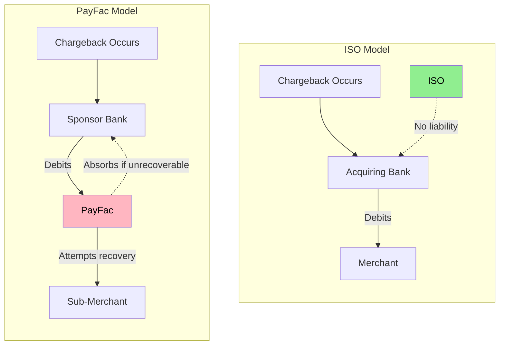
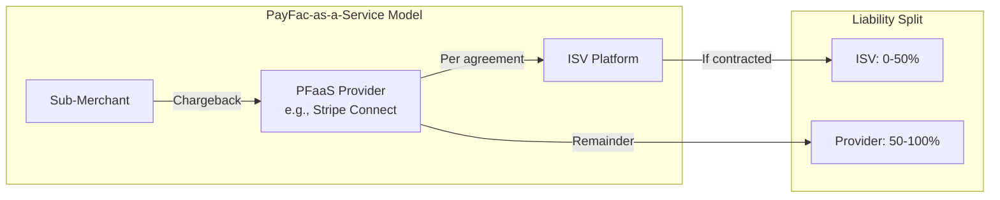
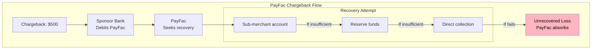
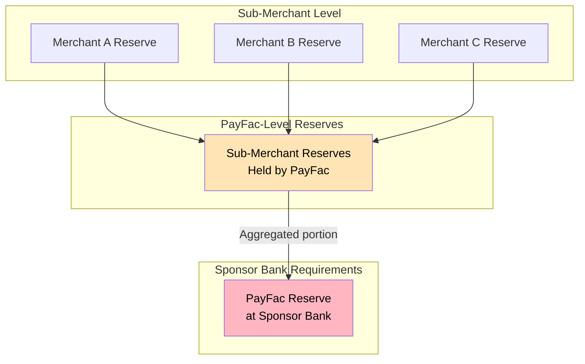
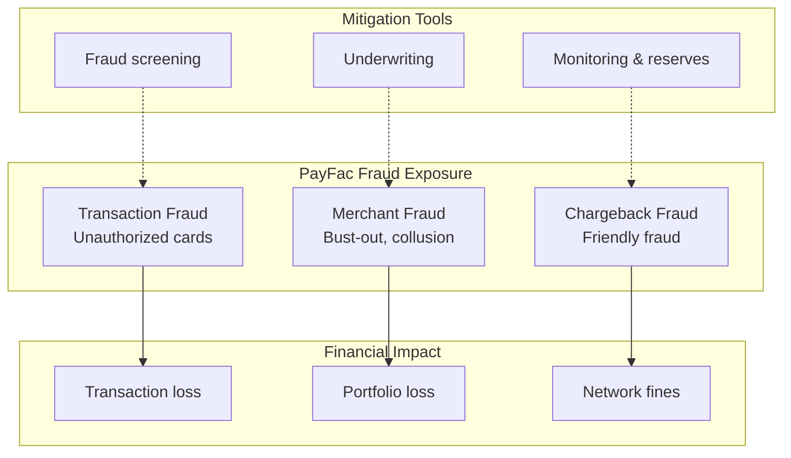
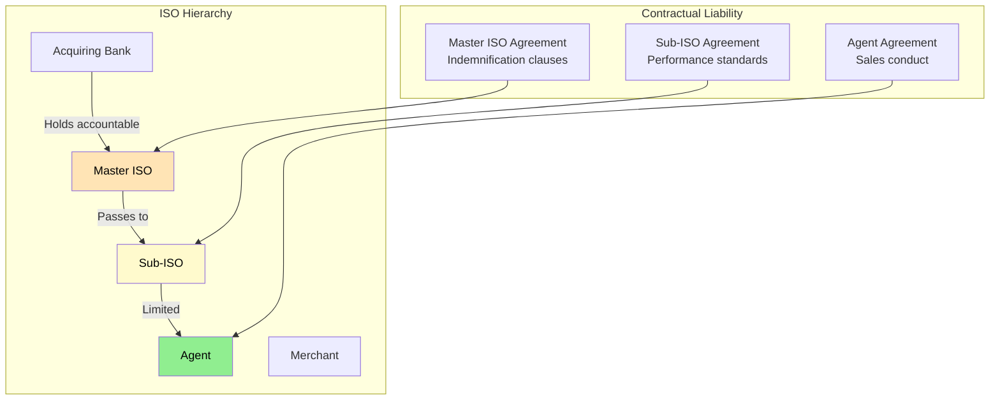

# Liability Structures

> **Last Updated:** 2025-02-17
> **Status:** Complete

Understanding how liability flows across payment entities is critical for partnership decisions, contract negotiations, and risk management strategies. This guide compares [chargeback](/glossary#chargeback) liability, fraud exposure, and reserve requirements across ISO, ISV, and PayFac models.

## Quick Reference

| Liability Type | ISO | ISV (Non-PayFac) | PayFac |
|----------------|-----|------------------|--------|
| **Chargeback Loss** | 0% | 0-100% (by contract) | 100% first-line |
| **Fraud Loss** | 0% | Contractual | 100% |
| **Network Fines** | Indirect | Indirect | Direct |
| **Reserve Obligation** | None | None | Yes |
| **MATCH Listing** | Principal only | Rare | Common |

## Chargeback Liability

### How Chargebacks Flow by Model

The chargeback liability chain differs dramatically between payment models:

### ISO: Pass-Through Liability

**Do ISOs have chargeback liability?** ISOs have **zero direct chargeback liability** in the standard model:

| Stage | ISO Role | Financial Impact |
|-------|----------|------------------|
| Chargeback received | None - goes to acquirer | $0 |
| Representment | May assist merchant | $0 |
| Loss realization | Merchant/acquirer absorbs | $0 |
| MATCH listing | Only if ISO principal involved | Reputational |

**Why ISOs Escape Liability:**
- Merchants have individual MIDs with the acquirer
- ISOs are sales/service agents, not payment principals
- Acquirer/processor holds the merchant relationship
- ISO agreement typically excludes financial liability

**Exceptions:**
- ISO provided false information during onboarding
- ISO principal engaged in fraud
- Contractual indemnification clauses (rare)

### ISV: Variable Liability by Model

ISV liability depends entirely on how payments are integrated:

| Integration Model | Chargeback Liability | Why |
|-------------------|---------------------|-----|
| **Referral** | 0% | Not a payment party |
| **API Integration** | 0% | Processor holds merchant relationship |
| **PFaaS (Connected)** | 0-50% | Shared per PFaaS agreement |
| **PayFac** | 100% | Full PayFac liability |

**PFaaS Liability Nuances:**

**Typical PFaaS Liability Structures:**

| Provider | ISV Liability | Notes |
|----------|---------------|-------|
| Stripe Connect (Standard) | 0% | Stripe handles all |
| Stripe Connect (Custom) | Configurable | ISV can take liability for better economics |
| Adyen for Platforms | Negotiated | Depends on contract tier |
| Finix | Configurable | Platform decides |

### PayFac: Full First-Line Liability

PayFacs bear **complete financial responsibility** for sub-merchant chargebacks:

**PayFac Chargeback Economics:**

| Component | Amount | Responsibility |
|-----------|--------|----------------|
| Transaction amount | $500 | PayFac debited |
| Chargeback fee | $25 | PayFac pays |
| Representment cost | $15 | PayFac pays |
| **Total exposure** | **$540** | PayFac |
| Recovery from sub-merchant | Variable | PayFac attempts |
| **Net loss** | **$0-540** | PayFac absorbs remainder |

## Reserve Requirements

### Reserve Obligations by Entity

| Entity | Reserve Required? | Who Holds Reserves? | Purpose |
|--------|-------------------|---------------------|---------|
| **ISO** | No | N/A | N/A |
| **ISV (Referral)** | No | N/A | N/A |
| **ISV (PFaaS)** | Rarely | PFaaS provider | Provider protection |
| **PayFac** | Yes | PayFac | Sub-merchant losses |

### PayFac Reserve Structure

PayFacs manage reserves at two levels:

**Typical Reserve Cascading:**

| Level | Reserve Held | Typical Amount |
|-------|--------------|----------------|
| Sub-merchant → PayFac | Rolling or fixed | 5-10% of volume |
| PayFac → Sponsor Bank | Corporate reserve | $500K-$5M+ |

### ISO Reserve Considerations

While ISOs don't hold merchant reserves, they may face:

| Scenario | ISO Impact |
|----------|------------|
| Merchant generates losses | ISO residuals may be reduced or clawed back |
| High-risk portfolio | Acquirer may require ISO performance bond |
| Fraudulent merchant referral | ISO may face contractual penalties |

## Fraud Liability

### Fraud Loss Distribution

| Fraud Type | ISO Liability | ISV Liability | PayFac Liability |
|------------|---------------|---------------|------------------|
| **Card testing** | None | Contractual | Full |
| **Friendly fraud** | None | Contractual | Full (via chargeback) |
| **Merchant fraud** | Contractual | None (referral) | Full |
| **Account takeover** | None | Varies | Full |

### PayFac Fraud Exposure

PayFacs face layered fraud exposure:

## Sub-Agent Liability Cascading

### ISO Hierarchy Liability

In ISO hierarchies, liability flows contractually:

**Typical Sub-Agent Contractual Terms:**

| Term | Master ISO | Sub-ISO | Agent |
|------|------------|---------|-------|
| Merchant quality standards | Defined | Accepted | Follows |
| Prohibited MCC liability | Indemnifies bank | Indemnifies master | Limited |
| Residual clawback | On losses | On losses | On commission |
| MATCH reporting | Cooperates | Cooperates | Reported |

### PayFac Sub-Merchant Liability

PayFacs manage sub-merchant liability through:

| Mechanism | Purpose | Implementation |
|-----------|---------|----------------|
| **Reserves** | Cover future losses | Withheld from payouts |
| **Delayed settlement** | Ensure delivery | 1-7 day payout delay |
| **Volume limits** | Control exposure | Per-transaction and daily caps |
| **Merchant agreements** | Legal recourse | Chargeback responsibility clauses |

## Contractual Risk Allocation

### Key Contract Terms by Entity

| Contract Element | ISO Agreement | ISV Agreement | PayFac Agreement |
|------------------|---------------|---------------|------------------|
| **Indemnification** | Limited to misrepresentation | Varies widely | Comprehensive |
| **Loss sharing** | None typically | Negotiated | Full first-loss |
| **Insurance required** | E&O common | Cyber liability | E&O + Cyber + Crime |
| **Termination for losses** | Portfolio performance | N/A | Chargeback thresholds |

### Sample Liability Allocation Matrix

When negotiating partnerships, use this framework:

| Risk Category | Allocate to ISO | Allocate to PayFac | Shared |
|---------------|-----------------|-------------------|--------|
| Merchant misrepresentation | ✓ (if ISO sourced) | ✓ (if PayFac onboarded) | |
| Transaction fraud | | ✓ | |
| Merchant bust-out | | ✓ | ✓ (if early warning missed) |
| Network fines | | ✓ | |
| Compliance violations | ✓ (if caused) | ✓ (baseline) | |

## Self-Assessment Questions

1. Why do ISOs have zero chargeback liability in the standard model?
2. How does PFaaS change liability allocation compared to a direct processor relationship?
3. What happens when a PayFac cannot recover a chargeback from a sub-merchant?
4. Why might a Master ISO include indemnification clauses for sub-ISO merchant quality?
5. How do reserves protect PayFacs from sub-merchant losses?

## Related Topics

- [Compliance Obligations](./compliance-obligations.md) - PCI, AML, network registration by entity
- [Network Program Applicability](./network-program-applicability.md) - VAMP, ECP, MATCH exposure
- [Reserve Management](../monitoring-programs/reserve-management.md) - PayFac reserve strategies
- [Chargeback Lifecycle](../chargebacks/lifecycle.md) - Chargeback processing flow
- [ISOs in the Ecosystem](/ecosystem/industry-players/isos) - ISO business model
- [ISVs in the Ecosystem](/ecosystem/industry-players/isvs) - ISV integration models
- [PayFac Model](/ecosystem/payfac-model/overview) - Payment Facilitator overview
- [Glossary](/glossary) - Chargeback, acquirer, and payment terms

## References

- [Visa Core Rules](https://usa.visa.com/dam/VCOM/download/about-visa/visa-rules-public.pdf) - Liability allocation rules
- [Mastercard Rules](https://www.mastercard.us/content/dam/public/mastercardcom/na/global-site/documents/mastercard-rules.pdf) - Service provider liability
- [ETA Guidelines](https://www.electran.org/) - ISO agreement best practices
