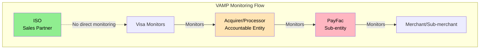
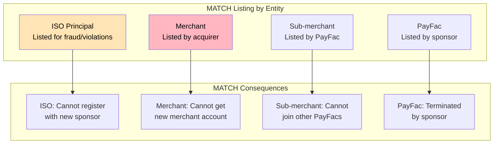
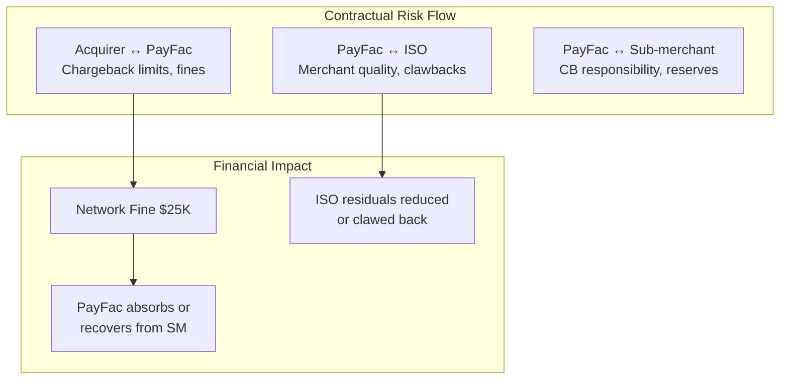

# Network Program Applicability

> **Last Updated:** 2025-02-17
> **Status:** Complete

Card network monitoring programs—[Visa VAMP](/glossary#vamp), [Mastercard ECP](/glossary#ecp), EFM, and [MATCH](/glossary#match)—apply differently to ISOs, ISVs, and PayFacs. Understanding these distinctions is critical for partnership decisions and risk management.

## Quick Reference

| Program | ISO Impact | ISV Impact | PayFac Impact |
|---------|------------|------------|---------------|
| **Visa VAMP** | Indirect (via acquirer) | None to indirect | Direct responsibility |
| **MC ECP** | Indirect | None to indirect | Direct responsibility |
| **MC EFM** | Indirect | None to indirect | Direct responsibility |
| **MATCH Listing** | Principal only | Rare | Sub-merchant listing |

## Program Overview

### Network Monitoring Programs

:::warning VAMP Transition (April 2025)
Visa VAMP (Visa Acquirer Monitoring Program) replaced VDMP and VFMP in April 2025. The unified program has different thresholds and applies at the acquirer/PayFac level.
:::

| Program | Network | Focus | Threshold |
|---------|---------|-------|-----------|
| **VAMP** | Visa | Chargebacks + Fraud | 1.5% ratio + 1,500 txns |
| **ECP** | Mastercard | Chargebacks | 1.5% ratio + 100 CBs |
| **EFM** | Mastercard | Fraud | 0.5% fraud + $50K + under 10% 3DS |
| **MATCH** | All Networks | Terminated Merchants | Various violation codes |

## VAMP Applicability

### How VAMP Applies by Entity

### ISO and VAMP

**Are ISOs monitored by VAMP?** No—**ISOs are NOT directly monitored by VAMP** because:

- ISOs do not hold merchant accounts
- Merchants referred by ISOs have individual MIDs with acquirers
- VAMP monitors at the acquirer level, not the referral partner level

**Indirect ISO Impact:**

| Scenario | ISO Consequence |
|----------|-----------------|
| Multiple ISO-referred merchants hit VAMP | Acquirer may terminate ISO relationship |
| ISO portfolio shows high CB patterns | Acquirer may restrict ISO onboarding |
| ISO-referred merchant MATCH listed | ISO reputation affected |

**ISO Protections:**
- Contractual provisions in ISO agreement
- Portfolio-level performance monitoring by acquirer
- No direct fines from Visa to ISO

### ISV and VAMP

**ISVs have variable VAMP exposure:**

| ISV Model | VAMP Exposure | Notes |
|-----------|---------------|-------|
| **Referral** | None | Not a payment participant |
| **API Integration** | None | Processor handles |
| **PFaaS** | Indirect | PFaaS provider monitored |
| **PayFac** | Direct | ISV-as-PayFac is monitored |

### PayFac and VAMP

**PayFacs are directly monitored by VAMP:**

| VAMP Element | PayFac Responsibility |
|--------------|----------------------|
| **Threshold monitoring** | Track aggregated chargeback ratios |
| **Sub-merchant management** | Identify and remediate high-CB merchants |
| **Program entry** | PayFac enters VAMP, not individual sub-merchants |
| **Fines** | PayFac pays fines (can recover from sub-merchants) |
| **Exit requirements** | PayFac must bring ratios below threshold |

**VAMP Thresholds for PayFacs:**

| Metric | Standard | Early Warning | Excessive |
|--------|----------|---------------|-----------|
| **CB Ratio** | Under 0.9% | 0.9-1.5% | Over 1.5% |
| **Transaction Count** | N/A | N/A | >1,500 CBs |

See [Network Monitoring Programs](../monitoring-programs/network-programs.md) for detailed VAMP coverage.

## ECP Applicability

### Mastercard Excessive Chargeback Program

| Entity | ECP Monitoring | Accountability |
|--------|----------------|----------------|
| **ISO** | Not monitored | N/A |
| **ISV (Non-PayFac)** | Not monitored | N/A |
| **PayFac** | Monitored at PayFac level | Direct |
| **Sub-merchant** | Monitored within PayFac | PayFac responsible |

### ECP Thresholds

| Tier | Chargeback Ratio | Chargeback Count | Monthly Fine |
|------|------------------|------------------|--------------|
| **ECP** | >1.5% | >100 | $1,000-$25,000 |
| **HECP** | >3.0% | >300 | $25,000-$100,000 |

### ISO Indirect Impact

ISOs may face consequences if their referred merchants generate ECP issues:

| Event | ISO Impact |
|-------|------------|
| Merchant enters ECP | ISO residuals may be reduced |
| Multiple ECP entries | Acquirer may review ISO agreement |
| Merchant terminated for ECP | Residual stream ends |

## EFM Applicability

### Mastercard Excessive Fraud Merchant Program

EFM focuses on fraud rather than chargebacks:

| Entity | EFM Monitoring | Impact |
|--------|----------------|--------|
| **ISO** | Not monitored | Indirect only |
| **ISV (Non-PayFac)** | Not monitored | N/A |
| **PayFac** | Monitored | Direct accountability |

### EFM Thresholds

| Metric | Threshold |
|--------|-----------|
| **Fraud Rate** | >0.5% |
| **Fraud Amount** | >$50,000 |
| **3DS Coverage** | Under 10% eligible transactions |

### Why EFM Matters for PayFacs

PayFacs with sub-merchants in high-fraud verticals must:

- Monitor fraud rates at sub-merchant level
- Implement 3D Secure for eligible transactions
- Terminate sub-merchants exceeding thresholds
- Pay fines for program entry

## MATCH List Implications

### MATCH (Member Alert to Control High-Risk Merchants)

MATCH is a terminated merchant database shared across acquirers. Listings affect future merchant account approvals.

### MATCH Listing by Entity Type

| Entity | How They Get Listed | MATCH Code | Frequency |
|--------|---------------------|------------|-----------|
| **ISO Principal** | Personal fraud, misrepresentation | 02, 05, 12 | Rare |
| **Merchant** | CB excess, fraud, violations | Various | Common |
| **Sub-merchant** | PayFac reports | Various | Common |
| **PayFac** | Sponsor bank reports | 01, 02, 04 | Rare |

### ISO MATCH Exposure

ISOs are generally **not listed on MATCH** because they are not merchants. However:

**ISO Principal Listing Scenarios:**
- ISO owner personally commits fraud (Code 02)
- ISO misrepresents business or merchants (Code 05)
- ISO principal is also a merchant owner (various codes)

**Consequences of ISO Principal Listing:**
- Cannot register as Third-Party Agent
- Cannot work with acquiring banks
- May affect associated businesses

### ISV MATCH Exposure

ISVs rarely appear on MATCH:

| ISV Model | MATCH Exposure |
|-----------|----------------|
| **Referral** | None |
| **API Integration** | None |
| **PFaaS** | None (users may be listed) |
| **PayFac** | Full exposure |

### PayFac MATCH Responsibilities

PayFacs have **MATCH reporting obligations**:

| Responsibility | Requirement |
|----------------|-------------|
| **Query before onboarding** | Check MATCH for all sub-merchant applicants |
| **Report terminations** | Add sub-merchants terminated for cause |
| **Timing** | Report within 1 business day (Mastercard) |
| **Accuracy** | Ensure correct reason codes |

**MATCH Reason Codes Relevant to PayFacs:**

| Code | Reason | Typical Trigger |
|------|--------|-----------------|
| 01 | Account Data Compromise | Data breach |
| 02 | Common Point of Purchase | Fraud investigation |
| 03 | Laundering | AML violation |
| 04 | Excessive Chargebacks | >1% ratio sustained |
| 05 | Excessive Fraud | >0.5% fraud rate |
| 09 | Bankruptcy/Liquidation | Business failure |
| 12 | PCI-DSS Non-compliance | Security violation |

## Program Responsibility Matrix

### Monitoring Program Responsibility by Role

| Program | Acquirer | PayFac | ISO | ISV (Non-PF) |
|---------|----------|--------|-----|--------------|
| **VAMP Monitoring** | Primary | Secondary | None | None |
| **VAMP Fines** | Pays | May absorb | None | None |
| **ECP Monitoring** | Primary | Secondary | None | None |
| **ECP Fines** | Pays | May absorb | None | None |
| **MATCH Query** | Required | Required | Not applicable | Not applicable |
| **MATCH Reporting** | Required | Required | Not applicable | Not applicable |

### Contractual Flow-Through

Risk flows through contracts even when direct monitoring doesn't apply:

## Risk Mitigation by Entity

### ISO Risk Mitigation

Even without direct program exposure, ISOs should:

| Action | Purpose |
|--------|---------|
| **Screen merchant referrals** | Avoid high-CB merchants |
| **Monitor portfolio metrics** | Track CB trends before acquirer acts |
| **Contractual protections** | Limit liability for merchant behavior |
| **Diversify acquirer relationships** | Reduce single-point-of-failure |

### ISV Risk Mitigation

ISVs should ensure their partners handle program risk:

| ISV Model | Mitigation Approach |
|-----------|---------------------|
| **Referral** | Choose reputable processors |
| **PFaaS** | Verify provider's program compliance |
| **PayFac** | Build full monitoring infrastructure |

### PayFac Risk Mitigation

PayFacs must proactively manage all programs:

| Program | Mitigation Strategy |
|---------|---------------------|
| **VAMP** | Real-time CB monitoring, early termination |
| **ECP** | Same as VAMP |
| **EFM** | 3DS implementation, fraud screening |
| **MATCH** | Pre-screening, appropriate termination reporting |

See [Merchant Monitoring](../monitoring-programs/merchant-monitoring.md) for implementation details.

## Self-Assessment Questions

1. Why are ISOs not directly monitored by VAMP or ECP?
2. How does VAMP monitoring differ between acquirers and PayFacs?
3. What scenarios could result in an ISO principal being MATCH listed?
4. Why do PayFacs have MATCH reporting obligations but ISOs do not?
5. How can ISOs mitigate risk from merchant chargebacks even without direct program exposure?

## Related Topics

- [Liability Structures](./liability-structures.md) - Chargeback liability by entity
- [Compliance Obligations](./compliance-obligations.md) - Registration requirements
- [Portfolio Risk Management](./portfolio-risk-management.md) - Sub-agent and merchant monitoring
- [Network Monitoring Programs](../monitoring-programs/network-programs.md) - VAMP, ECP, EFM details
- [Merchant Monitoring](../monitoring-programs/merchant-monitoring.md) - Building monitoring systems
- [Chargeback Management](../chargebacks/index.md) - Chargeback processing and prevention
- [ISOs in the Ecosystem](/ecosystem/industry-players/isos) - ISO business model
- [PayFac Model](/ecosystem/payfac-model/overview) - Payment Facilitator overview
- [Glossary](/glossary) - VAMP, ECP, MATCH definitions

## References

- [Visa Core Rules](https://usa.visa.com/dam/VCOM/download/about-visa/visa-rules-public.pdf) - VAMP program rules
- [Mastercard Rules](https://www.mastercard.us/content/dam/public/mastercardcom/na/global-site/documents/mastercard-rules.pdf) - ECP/EFM/MATCH rules
- [MATCH User Guide](https://www.mastercard.us/en-us/business/issuers/safety-and-security/match.html) - MATCH procedures
