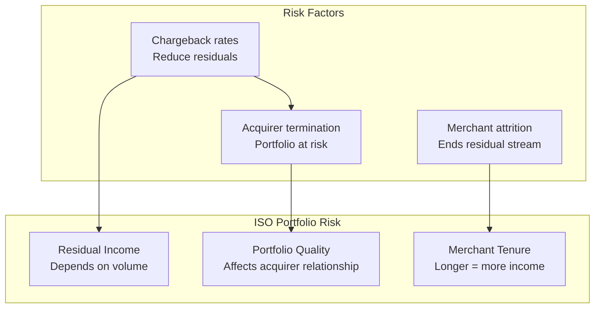
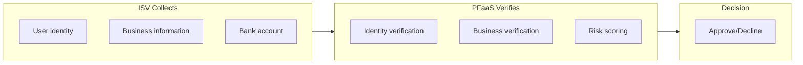
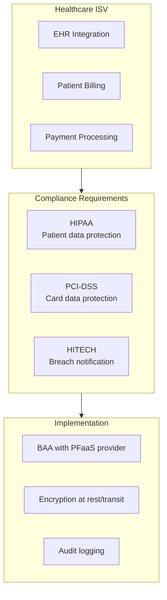
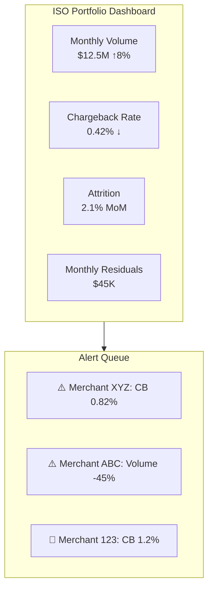

# Portfolio Risk Management

> **Last Updated:** 2025-02-17
> **Status:** Complete

While ISOs and ISVs have reduced [liability](./liability-structures.md) compared to [PayFacs](/ecosystem/payfac-model/overview), effective portfolio risk management is essential for sustainable partnerships and long-term residual income. This guide covers sub-agent due diligence, KYC/KYB delegation, and ongoing monitoring.

## Quick Reference

| Risk Area | ISO Focus | ISV Focus | PayFac Focus |
|-----------|-----------|-----------|--------------|
| **KYC/KYB** | Support collection | None to minimal | Full ownership |
| **Ongoing Monitoring** | Portfolio metrics | User behavior | Transaction-level |
| **Vertical Compliance** | Awareness | Industry expertise | Full implementation |
| **Termination Authority** | Recommend | None | Execute |

## ISO Portfolio Risk

### ISO Risk Profile

ISOs manage portfolio risk differently than PayFacs because:

- Acquirer performs actual underwriting decisions
- Individual merchants have their own MIDs
- ISO liability is contractual, not regulatory
- Residuals depend on merchant performance

### Sub-Agent Due Diligence

**What due diligence should Master ISOs perform on Sub-ISOs?** Master ISOs and Sub-ISOs must manage downstream agent risk:

| Due Diligence Area | Requirements |
|--------------------|--------------|
| **Background checks** | Criminal, credit, industry history |
| **Sales practices** | Review for misrepresentation |
| **Merchant quality** | Track referral performance |
| **Training** | Ensure compliance awareness |
| **Monitoring** | Ongoing portfolio review |

**Sub-Agent Agreement Key Terms:**

| Term | Purpose |
|------|---------|
| **Prohibited MCCs** | Define off-limits industries |
| **Quality standards** | Minimum CB ratios, processing volumes |
| **Residual clawbacks** | Recovery for merchant losses |
| **Termination rights** | Ability to end relationship |
| **Indemnification** | Liability allocation |

### ISO KYC/KYB Role

ISOs typically assist with—but don't own—KYC/KYB:

| Function | ISO Role | Acquirer Role |
|----------|----------|---------------|
| **Document collection** | Gather from merchant | Verify |
| **Application preparation** | Complete forms | Review |
| **Initial screening** | Basic eligibility | Full underwriting |
| **Ongoing verification** | Site visits (sometimes) | Periodic reviews |

**Best Practice ISO KYC Checklist:**

- [ ] Business name and DBA verification
- [ ] Owner/principal identification
- [ ] Business license status
- [ ] Bank account verification (voided check)
- [ ] Processing history (if available)
- [ ] MCC appropriateness
- [ ] Website review (for CNP)
- [ ] Physical location verification (for CP)

### ISO Portfolio Monitoring

Effective ISOs monitor their portfolio to protect residuals:

| Metric | Threshold | Action |
|--------|-----------|--------|
| **Chargeback ratio** | >0.5% | Contact merchant, review practices |
| **Chargeback ratio** | >0.75% | Escalate to acquirer, consider termination recommendation |
| **Volume decline** | >30% MoM | Check for business issues |
| **Refund spike** | >10% of volume | Investigate operational issues |
| **Attrition** | Any | Exit interview, retention effort |

## ISV Portfolio Risk

### ISV Risk Considerations

ISVs manage user risk rather than merchant risk (unless they're PayFacs):

| ISV Model | Risk Management Focus |
|-----------|----------------------|
| **Referral** | Processor reputation selection |
| **API Integration** | Integration security, user authentication |
| **PFaaS** | User eligibility, vertical compliance |
| **PayFac** | Full sub-merchant risk (see PayFac sections) |

### ISV User Due Diligence

For ISVs using PFaaS, user verification supports the provider's underwriting:

**ISV User Verification Responsibilities:**

| Model | ISV Responsibilities |
|-------|---------------------|
| **Referral** | None |
| **PFaaS (Standard)** | Collect basic info, PFaaS handles verification |
| **PFaaS (Custom)** | May include enhanced verification |
| **PayFac** | Full KYC/KYB ownership |

### ISV Vertical Compliance

ISVs often serve specific verticals with additional compliance requirements:

| Vertical | Compliance Overlay | ISV Responsibility |
|----------|-------------------|-------------------|
| **Healthcare** | HIPAA | PHI protection in payments |
| **Legal** | IOLTA/Trust Accounting | Proper fund segregation |
| **Cannabis** | State licensing | License verification |
| **Gaming** | State gambling laws | Age verification, geo-blocking |
| **Education** | FERPA | Student data protection |

**Example: Healthcare ISV Compliance**

## KYC/KYB Delegation

### Understanding KYC/KYB Ownership

| Entity | KYC/KYB Ownership | Notes |
|--------|-------------------|-------|
| **ISO** | Assists only | Acquirer owns decision |
| **ISV (PFaaS)** | Collects | Provider owns decision |
| **PayFac** | Full ownership | Must meet sponsor bank standards |

### ISO KYC Assistance Best Practices

When ISOs assist with KYC, they should:

| Practice | Benefit |
|----------|---------|
| **Use acquirer-provided checklists** | Ensure completeness |
| **Pre-screen for obvious issues** | Save underwriting time |
| **Verify document authenticity** | Reduce fraud |
| **Document site visits** | Provide verification evidence |
| **Flag high-risk indicators** | Enable risk-based review |

### ISV KYC Collection Standards

ISVs collecting KYC for PFaaS providers should:

| Standard | Implementation |
|----------|----------------|
| **Secure data handling** | Encrypted transmission, no local storage |
| **Complete required fields** | Match provider requirements |
| **Clear user consent** | Disclose data sharing |
| **Error handling** | Guide users to correct issues |

## Ongoing Monitoring Requirements

### ISO Ongoing Monitoring

ISOs should monitor their portfolio for:

| Monitoring Area | Frequency | Action Trigger |
|-----------------|-----------|----------------|
| **Chargeback rates** | Weekly | >0.5% |
| **Processing volume** | Monthly | >20% decline |
| **Merchant complaints** | Real-time | Any serious complaint |
| **Website changes** | Quarterly | For CNP merchants |
| **Business status** | Annually | Business license renewal |

**ISO Monitoring Dashboard Elements:**

### ISV Ongoing Monitoring

ISVs monitor user activity rather than payment metrics:

| Monitoring Area | Focus |
|-----------------|-------|
| **User behavior** | Account sharing, unusual patterns |
| **Vertical compliance** | License renewals, regulation changes |
| **Platform abuse** | Terms of service violations |
| **Support tickets** | Payment-related complaints |

### PayFac Ongoing Monitoring

For comparison, PayFacs must monitor at transaction level:

| Monitoring Area | Frequency | Requirement |
|-----------------|-----------|-------------|
| **Transaction patterns** | Real-time | Fraud detection |
| **Chargeback ratios** | Daily | VAMP/ECP compliance |
| **Sub-merchant verification** | Ongoing | Periodic re-verification |
| **Suspicious activity** | Real-time | SAR filing |

See [Merchant Monitoring](../monitoring-programs/merchant-monitoring.md) for PayFac monitoring details.

## Vertical-Specific Risk Management

### High-Risk Verticals

Certain verticals require enhanced risk management regardless of entity type:

| Vertical | Risk Factors | Mitigation |
|----------|--------------|------------|
| **Travel/Events** | Delivery delay, cancellations | Higher reserves, delayed settlement |
| **Nutraceuticals** | Regulatory, high chargebacks | Strict underwriting, monitoring |
| **Digital goods** | Fraud, friendly fraud | 3DS, digital delivery proof |
| **Subscriptions** | Recurring billing disputes | Clear cancellation, trial terms |
| **High-ticket** | Large individual losses | Enhanced verification, reserves |

### ISO Vertical Specialization

Specialized ISOs manage vertical risk through expertise:

| Specialization Benefit | Example |
|------------------------|---------|
| **Industry knowledge** | Understand normal patterns |
| **Merchant screening** | Know red flags |
| **Support quality** | Reduce chargeback-causing issues |
| **Acquirer relationships** | Access to vertical-friendly underwriting |

### ISV Vertical Compliance Matrix

ISVs in regulated verticals must layer compliance:

| Vertical | Payment Compliance | Industry Compliance | Combined Requirements |
|----------|-------------------|---------------------|----------------------|
| **Healthcare** | PCI-DSS | HIPAA | BAA, encryption, access controls |
| **Legal** | PCI-DSS | Bar rules, IOLTA | Trust accounting, fund segregation |
| **Cannabis** | PCI-DSS (limited) | State licensing | License verification, cash handling |
| **Gambling** | PCI-DSS | State gaming | Age verification, geo-blocking |

## Termination Authority and Process

### Termination Authority by Entity

| Entity | Termination Authority | Process |
|--------|----------------------|---------|
| **ISO** | Recommend only | Flag to acquirer, acquirer decides |
| **ISV (PFaaS)** | Request only | Flag to provider, provider decides |
| **PayFac** | Full authority | Direct termination, MATCH reporting |

### ISO Termination Recommendation Process

When an ISO identifies a problem merchant:

1. **Document the issue** - CB data, complaints, violations
2. **Contact the merchant** - Attempt remediation
3. **Escalate to acquirer** - Formal recommendation
4. **Acquirer decision** - Acquirer makes final call
5. **Residual impact** - Residuals end upon termination

### ISV User Termination Process

For PFaaS ISVs:

1. **Identify violation** - Terms, compliance, behavior
2. **Document evidence** - Screenshots, logs, reports
3. **Notify PFaaS provider** - Through designated channel
4. **Provider investigation** - Provider reviews
5. **Termination decision** - Provider decides
6. **Platform action** - ISV may also terminate software access

## Self-Assessment Questions

1. Why do ISOs need to manage portfolio risk even without direct chargeback liability?
2. What sub-agent due diligence should a Master ISO perform?
3. How does KYC/KYB ownership differ between ISOs and PayFacs?
4. What vertical compliance considerations apply to a healthcare ISV?
5. What is the ISO's role when recommending merchant termination?

## Related Topics

- [Liability Structures](./liability-structures.md) - Chargeback and fraud liability
- [Compliance Obligations](./compliance-obligations.md) - PCI, AML, network registration
- [Network Program Applicability](./network-program-applicability.md) - VAMP, ECP, MATCH exposure
- [Merchant Monitoring](../monitoring-programs/merchant-monitoring.md) - PayFac monitoring implementation
- [Reserve Management](../monitoring-programs/reserve-management.md) - Reserve strategies
- [Merchant Onboarding](/onboarding/index.md) - Underwriting and KYC processes
- [ISOs in the Ecosystem](/ecosystem/industry-players/isos) - ISO business model
- [ISVs in the Ecosystem](/ecosystem/industry-players/isvs) - ISV integration models
- [Glossary](/glossary) - KYC, KYB, sub-agent definitions

## References

- [ETA ISO Best Practices](https://www.electran.org/) - ISO due diligence guidelines
- [Visa Third-Party Agent Guidelines](https://usa.visa.com/dam/VCOM/download/about-visa/visa-rules-public.pdf) - Agent oversight
- [HIPAA Compliance](https://www.hhs.gov/hipaa/) - Healthcare ISV requirements
- [State Bar IOLTA Rules](https://www.americanbar.org/) - Legal vertical compliance
