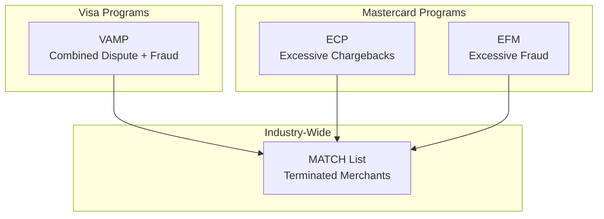
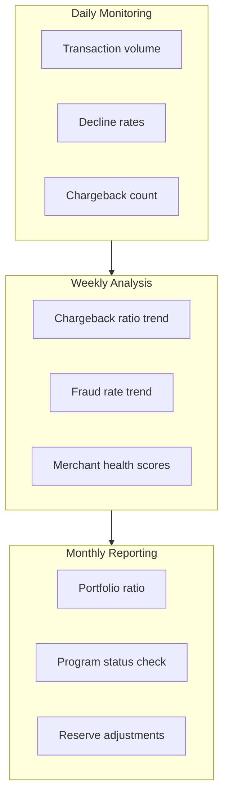

# Network Monitoring Programs

> **Last Updated:** 2025-02-17
> **Status:** Complete

Card networks monitor merchants and acquirers for excessive chargebacks and fraud. Exceeding thresholds triggers program entry, fines, and potential termination. For PayFacs, understanding these programs is critical to protecting your portfolio.

## Quick Reference

| Program | Network | Key Threshold | Fine Range |
|---------|---------|---------------|------------|
| VAMP | Visa | 1.5% (Apr 2026) | $4-8/transaction |
| ECP | Mastercard | 1.5% + 100 CB | $1,000-200,000/month |
| EFM | Mastercard | 0.5% fraud | $500-100,000/month |
| MATCH | Mastercard | Termination list | 5-year ban |

:::warning Major Program Change
**Effective April 1, 2025:** Visa retired VDMP and VFMP, replacing both with the **Visa Acquirer Monitoring Program (VAMP)**. All 2026 documentation should reference VAMP.
:::

## Program Overview

## Section Contents

### [Network Programs](./network-programs.md)
- Visa VAMP thresholds and fines
- Mastercard ECP program details
- Mastercard EFM program details
- MATCH list criteria and duration

### [Merchant Monitoring](./merchant-monitoring.md)
- Real-time monitoring dashboards
- Alert systems and thresholds
- Merchant health scoring

### [Reserve Management](./reserve-management.md)
- Rolling vs. fixed reserves
- Reserve calculation methods
- Release criteria and schedules

### [Quiz](./quiz.md)
- Self-assessment questions

## Critical Thresholds Summary

### Visa VAMP (Effective April 2025)

| Region | Threshold | Transaction Count | Effective |
|--------|-----------|-------------------|-----------|
| North America, EU, APAC | **1.5%** | ≥1,500 monthly | **April 1, 2026** |
| Latin America, Caribbean | 1.5% | ≥1,500 monthly | April 1, 2025 |
| CEMEA | 2.2% | ≥150 monthly + $75K | Current |

### Mastercard ECP

| Tier | Chargebacks | Ratio | Both Required |
|------|-------------|-------|---------------|
| ECM | ≥100/month | ≥1.5% | Yes |
| HECM | ≥300/month | ≥3.0% | Yes |

### Mastercard EFM

| Criterion | Threshold |
|-----------|-----------|
| Transaction volume | ≥1,000/month |
| Fraud amount | ≥$50,000 |
| Fraud ratio | ≥0.5% |
| 3DS usage | &lt;10% (non-regulated) |

## PayFac Monitoring Responsibilities

### Monitoring Metrics

| Metric | Frequency | Alert Threshold |
|--------|-----------|-----------------|
| Chargeback ratio | Daily | > 0.5% |
| Fraud rate | Daily | > 0.5% |
| Individual merchant ratio | Daily | > 1.0% |
| Portfolio ratio | Weekly | > 0.7% |
| Program threshold proximity | Weekly | Within 20% |

## Program Entry Prevention

### Early Warning Signs

| Indicator | Action Required |
|-----------|-----------------|
| Single merchant > 0.75% | Implement remediation plan |
| Portfolio trending up | Investigate causes |
| New merchant spikes | Review underwriting |
| Seasonal increase | Pre-position reserves |

### Prevention Strategies

1. **Strict Underwriting** - Reject high-risk merchants
2. **Real-time Monitoring** - Catch issues early
3. **Merchant Education** - Best practices for reducing chargebacks
4. **Quick Termination** - Remove problem merchants promptly
5. **Reserve Management** - Protect against losses

## Consequences of Program Entry

```mermaid
flowchart LR
    subgraph Entry["Program Entry"]
        E1[Threshold Exceeded]
    end

    subgraph Immediate["Immediate Impact"]
        I1[Monthly fines begin]
        I2[Remediation required]
        I3[Increased scrutiny]
    end

    subgraph Escalating["If Not Resolved"]
        S1[Higher fines]
        S2[Mandatory audits]
        S3[Account review]
    end

    subgraph Terminal["Final Consequences"]
        T1[Account termination]
        T2[MATCH listing]
        T3[5-year ban]
    end

    Entry --> Immediate
    Immediate --> Escalating
    Escalating --> Terminal
```

## Related Topics

- [Chargeback Management](../chargebacks/index.md) - Reducing chargebacks
- [Fraud Prevention](../fraud-prevention/index.md) - Reducing fraud rates
- [PCI Compliance](../pci-compliance/index.md) - Data security

## References

- [Visa Acquirer Monitoring Program](https://corporate.visa.com/)
- [Mastercard Chargeback Guide](https://www.mastercard.us/en-us/business/overview/support/rules.html)
- [Merchant Risk Council](https://merchantriskcouncil.org/)
