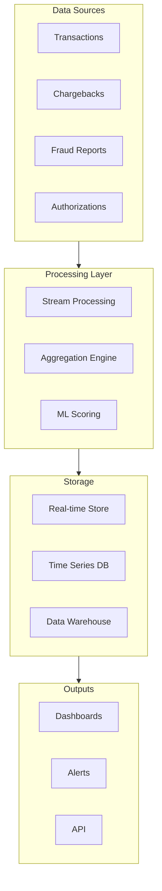
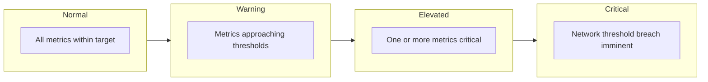
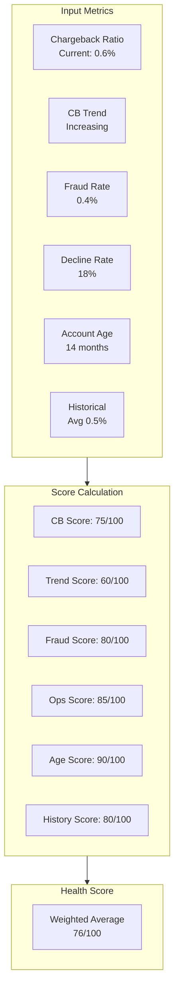
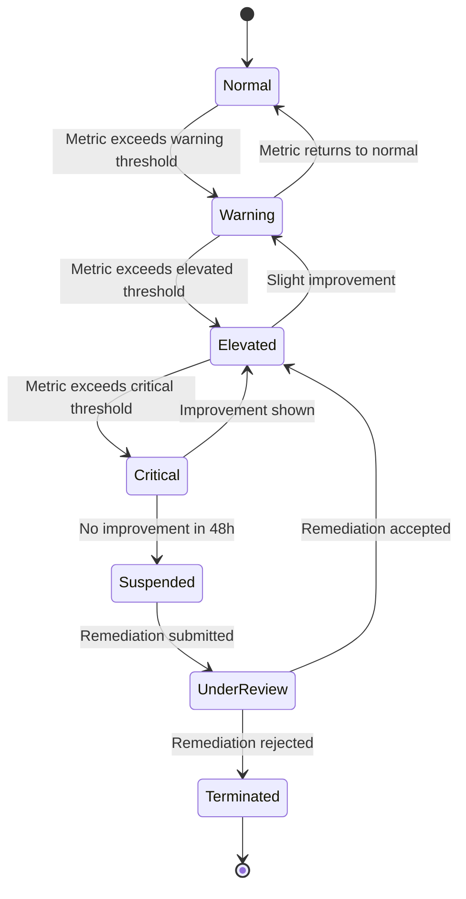
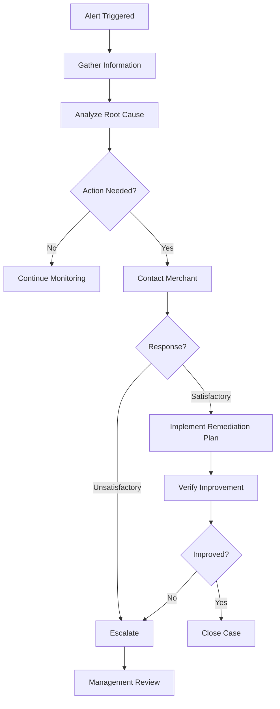

# Merchant Monitoring

> **Last Updated:** 2025-02-17
> **Status:** Complete

Effective merchant monitoring is the foundation of PayFac risk management. Real-time dashboards, intelligent alerts, and automated actions help identify and address risk before it impacts network compliance.

## Quick Reference

| Monitoring Area | Frequency | Alert Threshold |
|-----------------|-----------|-----------------|
| Chargeback ratio | Daily | > 0.5% |
| Fraud rate | Daily | > 0.5% |
| Decline rate | Hourly | > 30% |
| Transaction velocity | Real-time | 3x normal |
| Health score | Daily | < 70 |

## Monitoring Architecture



## Key Metrics to Monitor

### Chargeback Metrics

| Metric | Calculation | Target | Critical |
|--------|-------------|--------|----------|
| Chargeback ratio | Chargebacks / Transactions | < 0.5% | > 1.0% |
| Chargeback count | Raw count per period | Context | > 100/month |
| Chargeback trend | Week-over-week change | Declining | +25% |
| Win rate | Representments won / Total | > 40% | < 20% |

### Fraud Metrics

| Metric | Calculation | Target | Critical |
|--------|-------------|--------|----------|
| Fraud rate | Fraud chargebacks / Transactions | < 0.5% | > 1.0% |
| Fraud amount | Dollar value of fraud | Context | > $50K/month |
| 3DS adoption | 3DS transactions / Total | > 80% | < 50% |
| Authorization fraud | Fraud / Authorizations | < 0.1% | > 0.5% |

### Operational Metrics

| Metric | Calculation | Target | Critical |
|--------|-------------|--------|----------|
| Decline rate | Declines / Auth attempts | < 20% | > 35% |
| Refund rate | Refunds / Transactions | < 5% | > 15% |
| AVS mismatch rate | AVS failures / Total | < 10% | > 25% |
| CVV mismatch rate | CVV failures / Total | < 5% | > 15% |

### Volume Metrics

| Metric | Calculation | Target | Critical |
|--------|-------------|--------|----------|
| Daily volume | Transactions per day | Baseline | > 3x normal |
| Average ticket | Total $ / Transaction count | Stable | > 2x normal |
| Peak hour ratio | Peak volume / Average | < 3x | > 5x |
| New customer rate | First-time / Total | Context | Sudden spike |

## Alert Configuration

### Alert Levels



### Alert Thresholds by Metric

| Metric | Warning | Elevated | Critical |
|--------|---------|----------|----------|
| Chargeback ratio | > 0.5% | > 0.75% | > 1.0% |
| Fraud rate | > 0.5% | > 0.75% | > 1.0% |
| Decline rate | > 25% | > 30% | > 40% |
| Volume spike | > 2x | > 3x | > 5x |
| Health score | < 80 | < 70 | < 50 |

### Alert Actions

| Alert Level | Notification | Automated Action |
|-------------|--------------|------------------|
| Warning | Email to merchant | None |
| Elevated | Email + SMS to merchant + PayFac ops | Increase monitoring |
| Critical | Immediate page to ops team | Consider suspension |

## Merchant Health Score

A composite score that aggregates multiple risk factors into a single metric.

### Score Components

| Component | Weight | Description |
|-----------|--------|-------------|
| Chargeback ratio | 25% | Current month ratio |
| Chargeback trend | 15% | 30-day trend direction |
| Fraud rate | 20% | Fraud as % of transactions |
| Operational stability | 15% | Decline rate, refunds |
| Account age | 10% | Time since onboarding |
| Historical performance | 15% | 6-month average |

### Score Calculation



### Score Interpretation

| Score Range | Category | Action |
|-------------|----------|--------|
| 90-100 | Excellent | Standard monitoring |
| 80-89 | Good | Standard monitoring |
| 70-79 | Fair | Increased monitoring |
| 60-69 | Concerning | Monthly review, consider reserve |
| 50-59 | Poor | Weekly review, increase reserve |
| < 50 | Critical | Immediate action required |

## Dashboard Design

### Operations Dashboard

```
┌─────────────────────────────────────────────────────────────┐
│  PORTFOLIO OVERVIEW                              [Live] ⚡   │
├─────────────┬─────────────┬─────────────┬───────────────────┤
│ Merchants   │ CB Ratio    │ Fraud Rate  │ At Risk           │
│ 2,847       │ 0.42%       │ 0.38%       │ 23                │
│ ↑ 12 today  │ ↓ 0.02%     │ → stable    │ ↑ 3               │
├─────────────┴─────────────┴─────────────┴───────────────────┤
│  ALERTS (12 active)                                         │
│  ⚠️ MID-12345: CB ratio 0.95% - Critical                    │
│  ⚠️ MID-67890: Volume spike 4.2x - Elevated                 │
│  ⚠️ MID-11111: Health score 62 - Concerning                 │
├─────────────────────────────────────────────────────────────┤
│  TRENDING ISSUES                                            │
│  📈 Fraud up 15% WoW across electronics category            │
│  📉 CB down 8% after 3DS rollout                            │
└─────────────────────────────────────────────────────────────┘
```

### Merchant Detail View

```
┌─────────────────────────────────────────────────────────────┐
│  MERCHANT: Example Store (MID-12345)                        │
│  Health Score: 68 ⚠️   Status: Under Review                 │
├─────────────────────────────────────────────────────────────┤
│  KEY METRICS (Last 30 Days)                                 │
│  ┌───────────────────────────────────────────────────────┐  │
│  │ CB Ratio: 0.95% ████████████████████░░░░ Target: 0.5% │  │
│  │ Fraud:    0.42% ████████████░░░░░░░░░░░░ Target: 0.5% │  │
│  │ Declines: 22%   ████████████████░░░░░░░░ Target: 20%  │  │
│  └───────────────────────────────────────────────────────┘  │
├─────────────────────────────────────────────────────────────┤
│  CHARGEBACK TREND                                           │
│        ▲                                                    │
│  1.0%  │            ╱──●                                    │
│  0.8%  │      ●───●╱                                        │
│  0.6%  │  ●──●                                              │
│  0.4%  │●                                                   │
│        └────────────────────────────────▶                   │
│          W1   W2   W3   W4   Now                            │
├─────────────────────────────────────────────────────────────┤
│  ACTIONS                                                    │
│  [Request Documentation] [Increase Reserve] [Suspend]       │
└─────────────────────────────────────────────────────────────┘
```

## Automated Actions

### Action Triggers

| Trigger | Condition | Automated Action |
|---------|-----------|------------------|
| CB spike | > 1.5% single day | Pause payouts |
| Fraud spike | > 2% single day | Suspend processing |
| Volume spike | > 5x normal | Queue for review |
| Health drop | Score drops > 20 pts | Notify ops team |
| Network threshold | > 90% of VAMP/ECP | Escalate to management |

### Action Workflow



### Payout Controls

| Merchant Status | Payout Timing | Hold Amount |
|-----------------|---------------|-------------|
| Normal | Standard (T+2) | None |
| Warning | Standard | None |
| Elevated | Delayed (T+5) | None |
| Critical | Delayed (T+10) | 10% reserve |
| Suspended | Held | 100% hold |

## Investigation Workflow

### Triggered Investigation



### Investigation Checklist

| Step | Action | Documentation |
|------|--------|---------------|
| 1 | Review recent transactions | Transaction log |
| 2 | Analyze chargeback reasons | Reason code breakdown |
| 3 | Check for fraud patterns | Fraud report |
| 4 | Review customer complaints | Support tickets |
| 5 | Verify business operations | Merchant interview |
| 6 | Assess remediation options | Action plan |

## False Positive Management

### Common False Positives

| Scenario | Trigger | Resolution |
|----------|---------|------------|
| Seasonal spike | Volume exceeds threshold | Adjust baseline seasonally |
| New product launch | Sudden volume increase | Pre-notify before launch |
| Batch processing | Single large transaction | Configure batch alerts |
| Legitimate high-ticket | Average ticket spike | Category-appropriate thresholds |

### Tuning Recommendations

| Metric | Adjustment Approach |
|--------|---------------------|
| Volume | Use rolling 90-day baseline |
| Ticket size | Industry-specific thresholds |
| Decline rate | Account for new customer rate |
| Seasonal | Apply seasonal adjustment factors |

## Related Topics

- [Network Programs](./network-programs.md) - VAMP, ECP, EFM thresholds
- [Reserve Management](./reserve-management.md) - Financial controls
- [Chargeback Management](../chargebacks/index.md) - Chargeback handling

## References

- [Merchant Risk Council Best Practices](https://merchantriskcouncil.org/)
- [Payment Card Industry Security Standards](https://www.pcisecuritystandards.org/)
