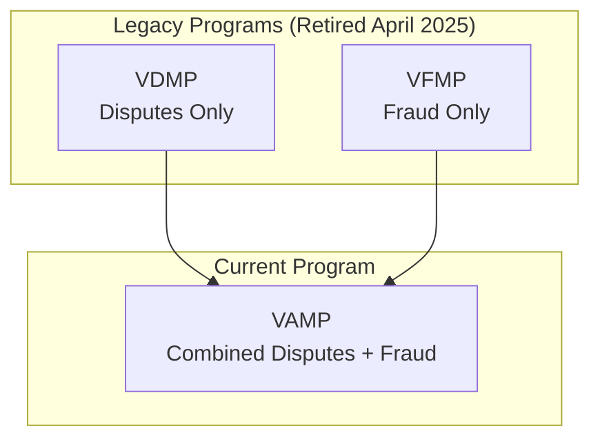
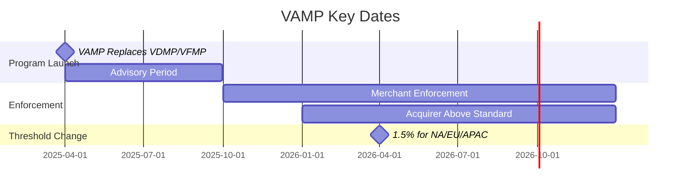
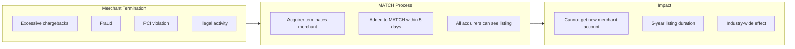

# Network Monitoring Programs

> **Last Updated:** 2025-02-17
> **Status:** Complete

Card networks operate monitoring programs to identify merchants and acquirers with excessive chargebacks or fraud. Understanding these programs is essential for PayFac risk management.

## Quick Reference

| Program | Network | Metric | Threshold | Fine Range |
|---------|---------|--------|-----------|------------|
| VAMP | Visa | Disputes + Fraud | 1.5% | $4-8/tx |
| ECP | Mastercard | Chargebacks | 1.5% + 100 | $1K-200K/mo |
| EFM | Mastercard | Fraud | 0.5% | $500-100K/mo |
| MATCH | All | Termination | N/A | 5-year ban |

## Visa Acquirer Monitoring Program (VAMP)

:::warning Program Replacement
**Effective April 1, 2025:** VAMP replaced both VDMP (Visa Dispute Monitoring Program) and VFMP (Visa Fraud Monitoring Program). All 2026 operations should use VAMP guidelines.
:::

### VAMP Overview

VAMP combines dispute and fraud monitoring into a single program with unified thresholds.



### VAMP Ratio Calculation

```
VAMP Ratio = (TC40 Fraud Reports + TC15 Disputes) / TC05 Settled Transactions
```

**Key Difference from Legacy:** VAMP includes disputes that never became chargebacks (TC15), not just completed chargebacks.

### Merchant Thresholds

| Region | Threshold | Transaction Count | Effective Date |
|--------|-----------|-------------------|----------------|
| North America | **1.5%** (150 bps) | ≥1,500 monthly | **April 1, 2026** |
| European Union | **1.5%** (150 bps) | ≥1,500 monthly | **April 1, 2026** |
| Asia Pacific | **1.5%** (150 bps) | ≥1,500 monthly | **April 1, 2026** |
| Latin America | 1.5% (150 bps) | ≥1,500 monthly | April 1, 2025 |
| Caribbean | 1.5% (150 bps) | ≥1,500 monthly | April 1, 2025 |
| CEMEA | 2.2% (220 bps) | ≥150 monthly + $75K | Current |

:::danger April 2026 Threshold Change
The reduction from 2.2% to 1.5% for North America/EU/APAC represents a **32% tightening** of acceptable limits. Merchants currently between 1.5-2.2% must remediate before April 2026.
:::

### Acquirer Thresholds

| Tier | Portfolio Threshold | Enforcement Start |
|------|---------------------|-------------------|
| Above Standard | ≥0.5% (50 bps) | January 1, 2026 |
| Excessive | ≥0.7% (70 bps) | October 1, 2025 |

### VAMP Fine Structure

| Entity | Tier | Fee per Dispute/Fraud |
|--------|------|----------------------|
| Acquirers | Above Standard | **$4** |
| Acquirers | Excessive | **$8** |
| Merchants | Excessive | **$8** |

### VAMP Grace Period

- **3 months** for first-time offenders within a rolling 12-month period
- Fines begin in month 4 if thresholds not corrected
- Must remain below thresholds for **3 consecutive months** to exit

### VAMP Timeline



## Legacy Visa Programs (Historical Reference)

### VDMP (Retired April 2025)

| Tier | Ratio | Count | Fines |
|------|-------|-------|-------|
| Early Warning | 0.65% | ≥75 | $0 |
| Standard | 0.9% | ≥100 | $0 (months 1-4), $50/dispute (5+) |
| Excessive | 1.8% | ≥1,000 | $50/dispute (immediate) |

### VFMP (Retired April 2025)

| Tier | Fraud Rate | Fraud Amount | Fines |
|------|------------|--------------|-------|
| Standard | >0.9% | ≥$75,000 | $25,000/month (month 5+) |
| Excessive | >1.8% | N/A | $10,000-$75,000/month escalating |

## Mastercard Excessive Chargeback Program (ECP)

ECP monitors merchants with high chargeback ratios and counts.

### ECP Thresholds

| Tier | Monthly Chargebacks | Ratio | Both Required |
|------|---------------------|-------|---------------|
| **ECM** | ≥100 | ≥1.5% | **YES** |
| **HECM** | ≥300 | ≥3.0% | **YES** |

:::info Calculation Method
Mastercard uses a **lagged denominator**: Current month chargebacks ÷ Prior month sales
:::

### ECP Fine Schedule

| Months in Program | ECM Fine | HECM Fine | Additional |
|-------------------|----------|-----------|------------|
| 1 | $0 | $0 | Grace period |
| 2 | $1,000 | $1,000 | - |
| 3 | $1,000 | $2,000 | - |
| 4-6 | **$5,000** | **$10,000** | +$5/CB after first 300 |
| 7-11 | **$25,000** | **$50,000** | +$5/CB after first 300 |
| 12-18 | **$50,000** | **$100,000** | +$5/CB after first 300 |
| 19+ | **$100,000** | **$200,000** | +$5/CB after first 300 |

### ECP Additional Fees

| Fee Type | Amount |
|----------|--------|
| Reporting fee | $100 |
| Issuer Recovery Assessment | $5/chargeback (beyond first 300, month 4+) |

### ECP Exit Criteria

- Below ECM threshold for **3 consecutive months**
- No probationary period after exit
- Immediate re-entry if thresholds exceeded again

## Mastercard Excessive Fraud Merchant (EFM)

EFM monitors merchants with high fraud rates.

### EFM Entry Criteria (ALL must be met)

| Criterion | Threshold |
|-----------|-----------|
| Transaction volume | ≥1,000 Mastercard transactions/month |
| Fraud amount | ≥$50,000 USD/EUR (reason code 4837) |
| Fraud ratio | ≥0.5% (50 bps) |
| 3DS usage (non-regulated) | &lt;10% |
| 3DS usage (regulated - EU) | &lt;50% |

**Australian Exception:** &lt;0.2% ratio AND &lt;$15,000 USD fraud claims

### EFM Ratio Calculation

```
Fraud Ratio = Current month fraud chargebacks / Prior month sales volume
```

### EFM Fine Structure

| Month | Fine Range |
|-------|------------|
| 1 | $0 (grace period) |
| 2+ | **$500 - $100,000** (escalates monthly) |

### EFM Exit Criteria

- Below ALL EFM thresholds for **3 consecutive months**

## MATCH List

**MATCH** (Member Alert to Control High-Risk Merchants) is an industry-wide database of terminated merchants.

### MATCH Overview



### MATCH Duration

- **5 years** from placement date
- Automatic removal after 5 years (unless re-added)

### MATCH Placement Timeline

Acquiring banks **must add** merchant within **5 days** of account termination for qualifying violations.

### MATCH Reason Codes

| Code | Reason | Early Removal |
|------|--------|---------------|
| 01 | Account Data Compromise | No |
| 02 | Common Point of Purchase | No |
| 03 | Laundering | No |
| 04 | Excessive Chargebacks | No |
| 05 | Excessive Fraud | No |
| 07 | Fraud Conviction | No |
| 09 | Bankruptcy/Liquidation/Insolvency | No |
| 10 | Violation of Standards | No |
| 11 | Merchant Collusion | No |
| 12 | PCI-DSS Non-Compliance | **Yes** (with compliance verification) |
| 13 | Illegal Transactions | No |
| 14 | Identity Theft | No |

### MATCH Impact

| Impact | Description |
|--------|-------------|
| Processing denied | Cannot obtain new merchant account |
| Industry-wide | All Mastercard member banks see listing |
| Visa awareness | Visa processors often check MATCH too |
| High-risk option | Some high-risk processors work with MATCH merchants (higher fees) |

### MATCH Removal

| Scenario | Removal Possible |
|----------|------------------|
| PCI non-compliance (code 12) | Yes, with compliance proof |
| All other codes | No, must wait 5 years |
| Error/dispute | Appeal process available |

## Program Comparison

| Factor | VAMP | ECP | EFM |
|--------|------|-----|-----|
| Network | Visa | Mastercard | Mastercard |
| Metric | Disputes + Fraud | Chargebacks | Fraud |
| Base Threshold | 1.5% | 1.5% + 100 | 0.5% |
| Fine Start | Month 4 | Month 2 | Month 2 |
| Exit Requirement | 3 months below | 3 months below | 3 months below |
| Grace Period | 3 months | 1 month | 1 month |

## PayFac Program Management

### Monitoring Dashboard

| Metric | Calculation | Alert Level |
|--------|-------------|-------------|
| Portfolio VAMP ratio | Total disputes/fraud ÷ Total transactions | > 0.5% |
| Portfolio ECP ratio | Total chargebacks ÷ Total sales | > 1.0% |
| Individual merchant ratio | Per-merchant calculation | > 0.75% |
| Program proximity | Current ratio ÷ Threshold | > 70% |

### Remediation Actions

```mermaid
flowchart TB
    subgraph Monitor["Continuous Monitoring"]
        M1[Track ratios daily]
        M2[Alert on thresholds]
    end

    subgraph Warning["Warning Zone (70-100% of threshold)"]
        W1[Notify merchant]
        W2[Require remediation plan]
        W3[Increase reserve]
    end

    subgraph Breach["Threshold Breach"]
        B1[Suspend processing]
        B2[Evaluate termination]
        B3[Report to sponsor bank]
    end

    subgraph Terminate["Termination"]
        T1[Close merchant account]
        T2[Add to MATCH (if applicable)]
        T3[Pursue collections]
    end

    Monitor --> Warning
    Warning --> Breach
    Breach --> Terminate
```

### Sub-Merchant Communication

| Stage | Communication |
|-------|---------------|
| Onboarding | Explain thresholds and consequences |
| Warning | Formal notice with remediation deadline |
| Breach | Suspension notice with appeal option |
| Termination | Final notice with MATCH warning |

## Related Topics

- [Merchant Monitoring](./merchant-monitoring.md) - Internal monitoring systems
- [Reserve Management](./reserve-management.md) - Financial protection
- [Chargeback Management](../chargebacks/index.md) - Reducing chargebacks

**Ecosystem Context:**
- [PayFac Model](/ecosystem/payfac-model/overview) - PayFac risk management overview
- [Acquiring Banks](/ecosystem/industry-players/acquiring-banks/overview) - Acquirer compliance obligations
- [Card Network Role](/ecosystem/fundamentals/card-network-role) - Network rule enforcement

**Onboarding Context:**
- [Merchant Agreements](/onboarding/merchant-lifecycle/merchant-agreements) - MATCH listing and termination procedures
- [Ongoing Monitoring](/onboarding/merchant-lifecycle/ongoing-monitoring) - Preventing program entry through monitoring

## References

- [Visa VAMP Program Guide](https://usa.visa.com/dam/VCOM/download/about-visa/visa-rules-public.pdf)
- [Mastercard Rules Manual](https://www.mastercard.us/content/dam/public/mastercardcom/na/global-site/documents/mastercard-rules.pdf)
- [Chargeback Gurus VAMP Guide](https://www.chargebackgurus.com/visa-acquirer-monitoring-program-vamp)
- [Merchant Risk Council](https://merchantriskcouncil.org/)
