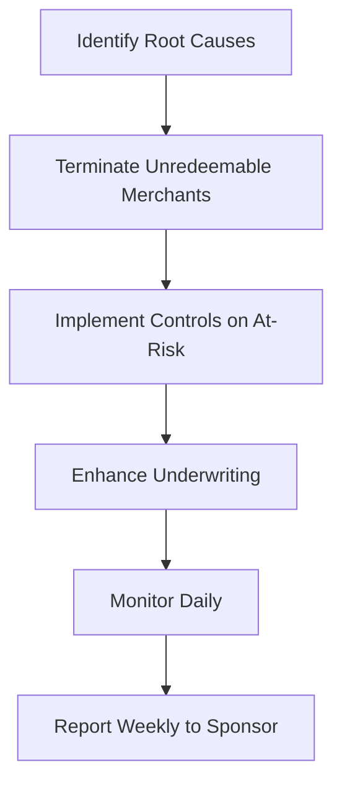

# Network Monitoring Quiz

> **Last Updated:** 2025-02-17
> **Status:** Complete

Test your understanding of network monitoring programs and reserve management.

## Network Programs

### Question 1: VAMP Thresholds

**What are the current VAMP thresholds for North American merchants, and when does the threshold change?**

<details>
<summary>View Answer</summary>

**Current Status:**
- Threshold: 1.5% (150 basis points) combined disputes + fraud
- Transaction count: ≥1,500 monthly disputes + fraud
- **Effective:** April 1, 2026 (reduced from 2.2%)

**Key Points:**
- VAMP replaced VDMP and VFMP as of April 1, 2025
- Ratio calculation includes TC40 fraud reports + TC15 disputes
- Uses settled transactions (TC05) as denominator

**Regional Variations:**
| Region | Threshold | Effective |
|--------|-----------|-----------|
| North America | 1.5% | April 1, 2026 |
| EU/APAC | 1.5% | April 1, 2026 |
| CEMEA | 2.2% | Current |

**Action Required:** Merchants currently between 1.5-2.2% must remediate before April 2026.
</details>

### Question 2: ECP vs VAMP

**What's the difference between Mastercard ECP and Visa VAMP entry criteria?**

<details>
<summary>View Answer</summary>

**Mastercard ECP:**
- Requires BOTH thresholds to be exceeded:
  - ≥100 chargebacks/month AND
  - ≥1.5% chargeback ratio
- Uses lagged denominator (current CB ÷ prior month sales)
- Chargebacks only (not all disputes)

**Visa VAMP:**
- Requires BOTH thresholds:
  - ≥1,500 disputes + fraud/month AND
  - ≥1.5% combined ratio
- Includes disputes that didn't become chargebacks
- Uses current month settled transactions

**Key Differences:**

| Factor | VAMP | ECP |
|--------|------|-----|
| Metric | Disputes + Fraud | Chargebacks only |
| Count threshold | 1,500 | 100 |
| Denominator | Current month | Prior month |
| Networks | Visa | Mastercard |

**Practical Impact:**
- VAMP catches issues earlier (includes pre-chargeback disputes)
- ECP has lower count threshold (100 vs 1,500)
- Both require ratio AND count thresholds met
</details>

### Question 3: MATCH Listing

**A merchant is terminated for excessive chargebacks. How long will they remain on the MATCH list, and can they get removed early?**

<details>
<summary>View Answer</summary>

**MATCH Duration:**
- **5 years** from placement date
- Automatic removal after 5 years

**Early Removal:**
| Reason Code | Early Removal Possible? |
|-------------|------------------------|
| 04 - Excessive Chargebacks | **No** |
| 05 - Excessive Fraud | No |
| 12 - PCI Non-Compliance | **Yes** (with compliance proof) |
| All other codes | No |

**Key Points:**
- Only PCI non-compliance (code 12) allows early removal
- Must demonstrate full PCI compliance
- Process requires working with original acquirer
- Appeal process available for errors

**Impact:**
- Cannot obtain new merchant account from any Mastercard member
- Visa processors typically check MATCH too
- Some high-risk processors work with MATCH merchants (higher fees)
</details>

## Reserve Management

### Question 4: Rolling Reserve Calculation

**A merchant has a 10% rolling reserve with 180-day release. They process $100,000/month. How much is held after 8 months?**

<details>
<summary>View Answer</summary>

**Calculation:**

| Month | Withheld | Released | Balance |
|-------|----------|----------|---------|
| 1 | $10,000 | $0 | $10,000 |
| 2 | $10,000 | $0 | $20,000 |
| 3 | $10,000 | $0 | $30,000 |
| 4 | $10,000 | $0 | $40,000 |
| 5 | $10,000 | $0 | $50,000 |
| 6 | $10,000 | $0 | $60,000 |
| 7 | $10,000 | $10,000 (Month 1) | $60,000 |
| 8 | $10,000 | $10,000 (Month 2) | $60,000 |

**Answer: $60,000**

**Key Insight:** Rolling reserve stabilizes at holding period × monthly withholding.
- 6 months × $10,000 = $60,000 steady state

After month 7, new withholding equals releases, maintaining constant balance.
</details>

### Question 5: Reserve Triggers

**When should a reserve be increased? When can it be decreased or released?**

<details>
<summary>View Answer</summary>

**Increase Triggers:**

| Trigger | Action |
|---------|--------|
| CB ratio > 0.75% | Add 5% reserve |
| CB ratio > 1.0% | Add 10% reserve |
| Network program entry | Cover expected fines |
| Fraud spike | Immediate increase |
| Health score drop > 15 pts | Review and adjust |
| Industry risk change | Reassess policy |

**Decrease/Release Triggers:**

| Trigger | Action |
|---------|--------|
| 6 months < 0.5% CB ratio | Consider 5% reduction |
| 12 months clean history | Consider full release |
| Health score > 90 for 6 months | Review for reduction |
| Account closure (good standing) | Release after 180-day wait |

**Release Process:**
1. Formal request from merchant
2. Review current risk profile
3. Verify no outstanding chargebacks
4. Management approval
5. Gradual release (not all at once)
</details>

### Question 6: Reserve Strategy

**Scenario:** A merchant's chargeback ratio is 0.8% and trending upward. They process $500K/month. What reserve strategy would you recommend?

<details>
<summary>View Answer</summary>

**Risk Assessment:**
- CB ratio: 0.8% (approaching 1% threshold)
- Trend: Upward (dangerous)
- Volume: $500K/month (substantial exposure)
- Risk level: HIGH

**Recommended Reserve Strategy:**

| Component | Recommendation |
|-----------|----------------|
| **Type** | Rolling reserve |
| **Rate** | 15% (high due to trend) |
| **Holding period** | 180 days |
| **Minimum balance** | $75,000 target |

**Calculation:**
- Monthly exposure: $500K × 0.8% = $4,000 in chargebacks
- If ratio hits 1.5%: $7,500/month
- 6-month exposure: $45,000
- With buffer: $75,000 reserve target

**Additional Actions:**

1. **Immediate:**
   - Implement 15% rolling reserve
   - Delay payouts to T+5
   - Send formal warning letter

2. **30 Days:**
   - Require remediation plan
   - Review 3DS implementation
   - Analyze chargeback reasons

3. **60 Days:**
   - Evaluate progress
   - Increase reserve if no improvement
   - Consider suspension if ratio > 1%

**Communication:**
```
"Due to your elevated chargeback ratio of 0.8%, we are
implementing a 15% rolling reserve with 180-day hold.
This protects both parties and can be reduced once
your ratio falls below 0.5% for 6 consecutive months."
```
</details>

## Scenario Questions

### Question 7: Monitoring Dashboard Design

**Scenario:** Design a monitoring dashboard for operations teams. What key metrics and alerts should be visible?

<details>
<summary>View Answer</summary>

**Dashboard Layout:**

```
┌─────────────────────────────────────────────────────────────┐
│  PORTFOLIO OVERVIEW                              [Live] ⚡  │
├─────────────┬─────────────┬─────────────┬─────────────────┤
│ Merchants   │ CB Ratio    │ Fraud Rate  │ At Risk        │
│ 2,847       │ 0.42%       │ 0.38%       │ 23             │
└─────────────┴─────────────┴─────────────┴─────────────────┘
```

**Key Metrics:**

| Metric | Display | Alert Threshold |
|--------|---------|-----------------|
| Portfolio CB ratio | Gauge + trend | > 0.5% warning, > 0.7% critical |
| Portfolio fraud rate | Gauge + trend | > 0.5% warning, > 0.7% critical |
| Merchants at risk | Count + list | Any > 0.75% |
| Network threshold proximity | % of limit | > 80% warning |
| Reserve utilization | Total held vs. target | < 90% of target |

**Alert Panel:**

| Priority | Alert Type | Example |
|----------|------------|---------|
| Critical | Network threshold | "MID-12345: 0.95% CB ratio" |
| High | Velocity spike | "MID-67890: 5x volume today" |
| Medium | Health score drop | "MID-11111: Score 72→58" |
| Low | Trend warning | "Category X: +15% WoW" |

**Drill-Down Capabilities:**
- Click merchant → Full detail view
- Click metric → Historical trend
- Click alert → Investigation workflow

**Automated Actions Visible:**
- Payout holds
- Reserve adjustments
- Suspension status
</details>

### Question 8: Program Entry Response

**Scenario:** Your PayFac just received notice that you've entered VAMP at the Excessive tier. What immediate actions should be taken?

<details>
<summary>View Answer</summary>

**Immediate Actions (Within 24 Hours):**

1. **Notify Leadership**
   - Escalate to executive team
   - Engage sponsor bank
   - Prepare board briefing

2. **Financial Assessment**
   - Calculate expected fines ($8/transaction at Excessive)
   - Increase portfolio reserves
   - Review sponsor bank requirements

3. **Identify Top Contributors**
   - List merchants contributing most to ratio
   - Prioritize by impact and remediability

**Week 1 Actions:**

| Action | Owner |
|--------|-------|
| Suspend worst offenders | Operations |
| Increase reserves on at-risk | Finance |
| Implement enhanced monitoring | Risk |
| Develop remediation plan | Risk + Ops |
| Communicate to sponsor bank | Account management |

**Remediation Plan Components:**



**Timeline Targets:**

| Month | Target | Action if Missed |
|-------|--------|------------------|
| 1 | Reduce to 1.8% | Accelerate terminations |
| 2 | Reduce to 1.5% | Pause new merchant boarding |
| 3 | Below threshold | Maintain for exit |

**Exit Criteria:**
- Below 1.5% for 3 consecutive months
- Demonstrated sustainable controls
- Sponsor bank approval
</details>

### Question 9: Merchant Communication

**A merchant disputes their reserve requirement, claiming their CB ratio is only 0.3%. How do you handle this?**

<details>
<summary>View Answer</summary>

**Step 1: Acknowledge and Review**

```
"I understand your concern about the reserve requirement.
Let me review your account data and explain our methodology."
```

**Step 2: Explain Factors**

Reserve is based on multiple factors, not just CB ratio:

| Factor | Their Status | Impact |
|--------|--------------|--------|
| CB ratio | 0.3% | Favorable |
| Industry risk | High-risk category | +10% |
| Account age | < 12 months | +5% |
| Delivery timeframe | 45+ days | +5% |
| Average ticket | $500+ | +5% |
| **Combined** | | 15-20% reserve |

**Step 3: Provide Options**

| Option | Trade-off |
|--------|-----------|
| Accept current reserve | No changes |
| Lower rate, longer hold | 10% with 270-day hold |
| Provide bank guarantee | Reduce to 5% |
| Wait for history | Reassess at 12 months |

**Step 4: Document Agreement**

```
"Based on our review, we can offer [option].
This will be reassessed when [condition] is met.
Please confirm your preference in writing."
```

**Key Message:**
The reserve protects both parties. Low CB ratio is good, but forward-looking risk factors also matter.
</details>

## Summary

After completing this quiz, you should understand:

- [ ] VAMP thresholds and the April 2026 changes
- [ ] Differences between VAMP and ECP entry criteria
- [ ] MATCH listing duration and removal options
- [ ] Rolling reserve calculations and stabilization
- [ ] Reserve increase/decrease triggers
- [ ] Monitoring dashboard design principles
- [ ] Program entry response procedures

## Related Topics

- [Network Programs](./network-programs.md) - Detailed program information
- [Merchant Monitoring](./merchant-monitoring.md) - Monitoring systems
- [Reserve Management](./reserve-management.md) - Reserve policies
- [Chargeback Management](../chargebacks/index.md) - Reducing chargebacks
