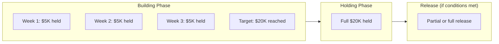
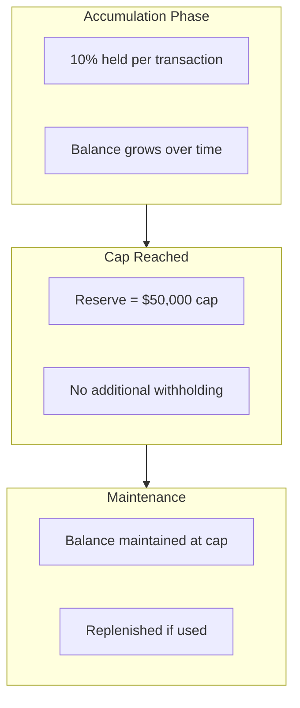
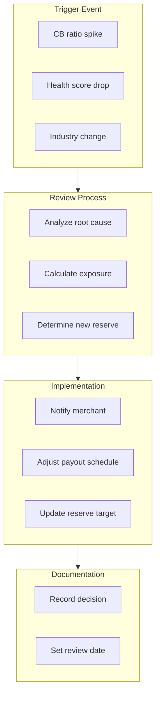
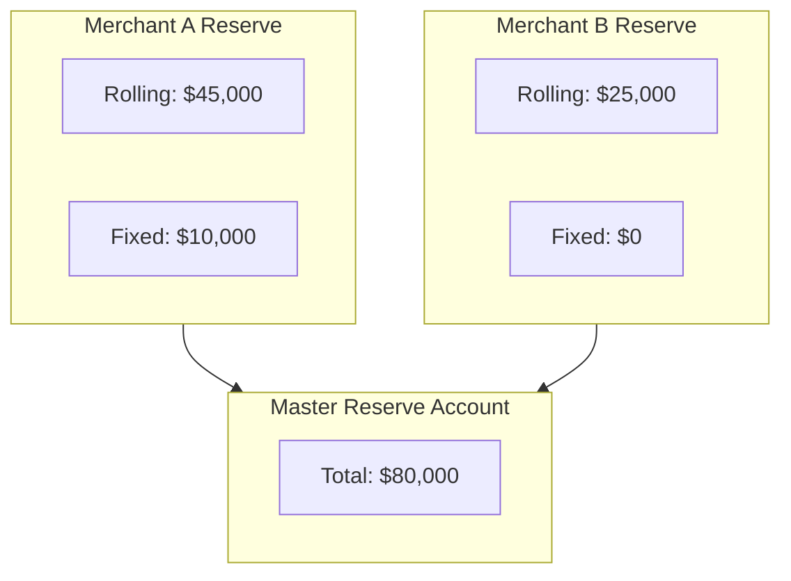

# Reserve Management

> **Last Updated:** 2025-02-17
> **Status:** Complete

Reserves are funds withheld from merchant payouts to cover potential chargebacks, refunds, and other liabilities. Effective reserve management protects the PayFac while maintaining merchant relationships.

## Quick Reference

| Reserve Type | Typical Rate | Holding Period | Release |
|--------------|--------------|----------------|---------|
| Rolling | 5-10% | 90-180 days | Automatic |
| Fixed | Lump sum | Until conditions met | Manual |
| Capped | 5-10% | Until cap reached | Partial automatic |

## Reserve Types

### Rolling Reserve

A percentage of each transaction is withheld and released after a holding period.

```mermaid
flowchart LR
    subgraph Day1["Day 1"]
        T1[Transaction $100]
        H1[Hold $10 (10%)]
    end

    subgraph Day180["Day 180"]
        R1[Release $10]
    end

    subgraph Ongoing["Continuous"]
        BAL[Reserve Balance]
    end

    Day1 --> Ongoing
    Ongoing --> Day180
```

| Factor | Typical Value |
|--------|---------------|
| Percentage | 5-10% of gross volume |
| Holding period | 90-180 days |
| Release | Automatic after holding period |
| Balance | Builds then stabilizes |

### Fixed Reserve

A lump sum held upfront or built over time, not released until conditions are met.



| Factor | Typical Value |
|--------|---------------|
| Amount | Based on monthly volume estimate |
| Build period | 30-90 days |
| Release | Manual, based on performance |
| Duration | Often 6-12 months minimum |

### Capped Reserve

A rolling reserve that stops accumulating once a cap is reached.



## Reserve Calculation

### Rolling Reserve Example

| Month | Volume | Reserve Rate | Withheld | Released (180 days ago) | Balance |
|-------|--------|--------------|----------|-------------------------|---------|
| 1 | $100,000 | 10% | $10,000 | $0 | $10,000 |
| 2 | $100,000 | 10% | $10,000 | $0 | $20,000 |
| 3 | $100,000 | 10% | $10,000 | $0 | $30,000 |
| 4 | $100,000 | 10% | $10,000 | $0 | $40,000 |
| 5 | $100,000 | 10% | $10,000 | $0 | $50,000 |
| 6 | $100,000 | 10% | $10,000 | $0 | $60,000 |
| 7 | $100,000 | 10% | $10,000 | $10,000 | $60,000 |
| 8 | $100,000 | 10% | $10,000 | $10,000 | $60,000 |

**Result:** Reserve stabilizes at ~6 months of withholding.

### Industry Standards by Risk Level

| Risk Level | Reserve % | Holding Period |
|------------|-----------|----------------|
| Low | 5-10% | 30-90 days |
| Medium | 10-15% | 90-180 days |
| High | 15-100% | 180+ days |

### High-Risk Industries

| Industry | Typical Reserve | Rationale |
|----------|-----------------|-----------|
| Travel/hospitality | 20-100% | Delivery delay, cancellations |
| Nutraceuticals | 15-25% | High chargeback rates |
| Adult content | 15-20% | Reputation risk |
| Gambling | 20-30% | Regulatory risk |
| Subscriptions | 10-20% | Recurring billing disputes |
| High-ticket items | 15-25% | Large individual losses |

## Reserve Policy Design

### Factors to Consider

| Factor | Impact on Reserve |
|--------|------------------|
| Industry risk | Higher risk = higher reserve |
| Merchant history | Poor history = higher reserve |
| Chargeback ratio | Higher ratio = higher reserve |
| Delivery timeframe | Longer delivery = longer holding |
| Average ticket | Higher ticket = higher reserve |
| Business age | Newer business = higher reserve |

### Reserve Schedule by Risk Score

| Health Score | Reserve % | Holding Period | Release Criteria |
|--------------|-----------|----------------|------------------|
| 90-100 | 0-5% | 30 days | Automatic |
| 80-89 | 5-10% | 60 days | Automatic |
| 70-79 | 10-15% | 90 days | Review required |
| 60-69 | 15-20% | 180 days | Review required |
| < 60 | 20-100% | 180+ days | Manual only |

## Reserve Adjustments

### Triggers for Increase

| Trigger | Action |
|---------|--------|
| CB ratio > 0.75% | Add 5% to reserve |
| CB ratio > 1.0% | Add 10% to reserve |
| Fraud spike | Immediate increase |
| Health score drop > 15 pts | Review and adjust |
| Network program entry | Increase to cover fines |

### Triggers for Decrease

| Trigger | Action |
|---------|--------|
| 6 months < 0.5% CB ratio | Consider 5% reduction |
| 12 months clean history | Consider full release |
| Health score > 90 for 6 months | Review for reduction |

### Adjustment Process



## Reserve Release

### Automatic Release Criteria

| Condition | Release Action |
|-----------|---------------|
| Holding period complete | Release oldest funds |
| Account in good standing | Automatic release |
| No outstanding chargebacks | Release proceeds |

### Manual Release Criteria

| Condition | Review Required |
|-----------|-----------------|
| Early release request | Management approval |
| Account closure | Final settlement review |
| Risk level change | Reserve policy review |

### Release Schedule Example

| Release Trigger | Percentage Released | Timing |
|-----------------|---------------------|--------|
| 180-day maturity | 100% of matured funds | Automatic |
| 6-month good standing | 25% of fixed reserve | Upon review |
| 12-month good standing | 50% additional | Upon review |
| Account closure | Remaining balance | After 180-day wait |

## Reserve Disputes

### Common Merchant Objections

| Objection | Response |
|-----------|----------|
| "My CB ratio is low" | Explain forward-looking risk |
| "I need cash flow" | Offer alternative (lower rate, longer hold) |
| "Competitors don't hold" | Explain PayFac vs. ISO differences (see below) |
| "Release early" | Require collateral or guarantee |

:::info ISO vs PayFac Reserve Differences
When merchants compare PayFac reserve requirements to ISOs, explain the fundamental model difference:

- **ISOs:** Merchants have individual MIDs with acquirers. Reserves (if any) are held by the acquirer based on individual merchant risk
- **PayFacs:** Sub-merchants share the PayFac's master MID. PayFac bears first-line liability, requiring reserves for protection

ISOs don't hold reserves from merchants because they don't bear chargeback liability. See [ISO & ISV Perspectives](../iso-isv-perspectives/index.md) for detailed comparison.
:::

### Dispute Resolution Process

1. **Acknowledge** - Document merchant's concerns
2. **Review** - Analyze current risk profile
3. **Calculate** - Determine minimum viable reserve
4. **Negotiate** - Find acceptable compromise
5. **Document** - Record agreement in writing
6. **Monitor** - Track compliance with agreement

## Financial Accounting

### Reserve Account Structure



### Reserve vs. Liabilities

| Account | Purpose | Owner |
|---------|---------|-------|
| Reserve balance | Held funds | Merchant (restricted) |
| Chargeback liability | Expected losses | PayFac |
| Outstanding disputes | Pending resolution | Varies |

## 2026 Trends

### AI-Driven Dynamic Reserves

| Capability | Benefit |
|------------|---------|
| Real-time risk scoring | Immediate reserve adjustment |
| Predictive modeling | Forward-looking reserves |
| Behavioral analysis | Early risk detection |
| Automated adjustment | Reduced manual intervention |

### Industry Evolution

| Trend | Impact |
|-------|--------|
| Instant payouts | Pressure to reduce reserves |
| Higher fraud rates | Need for higher reserves |
| Regulatory scrutiny | More transparency required |
| Merchant competition | Pressure for merchant-friendly policies |

## Related Topics

- [Network Programs](./network-programs.md) - Reserve triggers from monitoring
- [Merchant Monitoring](./merchant-monitoring.md) - Risk indicators
- [Chargeback Management](../chargebacks/index.md) - Reserve usage for CBs
- [ISO & ISV Perspectives](../iso-isv-perspectives/index.md) - Reserve requirements by entity type
- [Liability Structures](../iso-isv-perspectives/liability-structures.md) - Why ISOs don't hold reserves

**Onboarding Context:**
- [Merchant Agreements & Reserves](/onboarding/merchant-lifecycle/merchant-agreements) - Reserve setup during onboarding
- [Risk Factors](/onboarding/underwriting/risk-factors) - Risk-based reserve determination

## References

- [Merchant Maverick - Rolling Reserves](https://www.merchantmaverick.com/rolling-reserve/)
- [Electronic Transactions Association](https://www.electran.org/)
