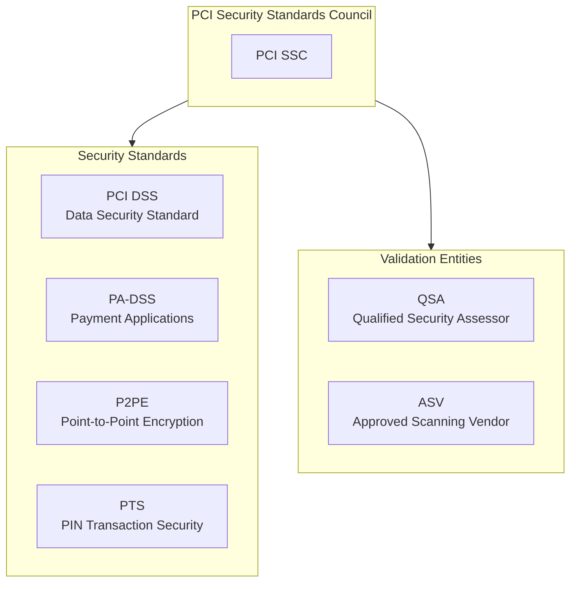
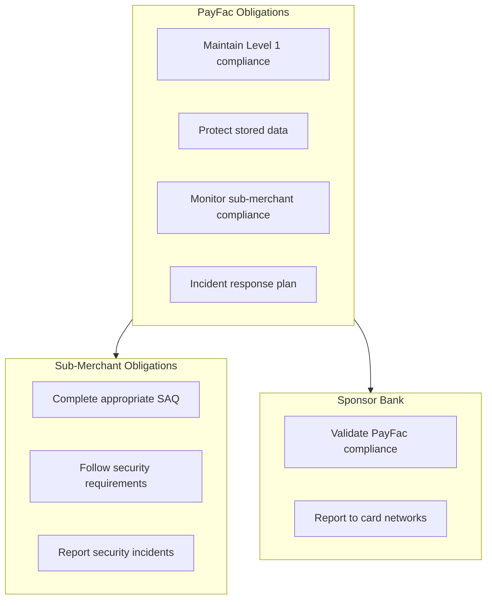
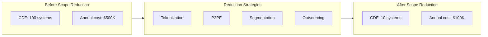

# PCI-DSS Compliance

> **Last Updated:** 2025-02-17
> **Status:** Complete

The Payment Card Industry Data Security Standard (PCI-DSS) establishes requirements for protecting cardholder data. For PayFac platforms, PCI compliance is mandatory—typically at the most stringent Level 1 Service Provider requirements.

## Quick Reference

| Item | Status (2026) |
|------|---------------|
| Current Version | PCI DSS v4.0.1 |
| Future-Dated Requirements | **All mandatory** (March 31, 2025) |
| Level 1 Service Provider | > 300,000 transactions/year |
| Level 1 Merchant | > 6 million transactions/year |

:::warning All v4.0 Requirements Now Mandatory
As of **March 31, 2025**, all 51 "future-dated" requirements in PCI DSS v4.0 became mandatory. Organizations must be fully compliant with all v4.0.1 requirements.
:::

## What is PCI-DSS?

PCI-DSS is a security standard created by the Payment Card Industry Security Standards Council (PCI SSC), founded by Visa, Mastercard, American Express, Discover, and JCB.

## Why PayFacs Are Level 1

PayFac platforms are typically classified as **Level 1 Service Providers** because:

| Factor | Impact |
|--------|--------|
| Transaction volume | Usually > 300,000/year |
| Data handling | Process/transmit cardholder data |
| Sub-merchant responsibility | Manage multiple merchants |
| Risk profile | High-value target for attackers |

## Section Contents

### [Requirements](./requirements.md)
- The 12 PCI-DSS requirements overview
- Key v4.0 changes
- Service provider-specific requirements

### [Scope Management](./scope-management.md)
- Cardholder Data Environment (CDE)
- Scope reduction strategies
- Network segmentation

### [Tokenization](./tokenization.md)
- Token strategies
- Point-to-Point Encryption (P2PE)
- Scope reduction through tokenization

### [Quiz](./quiz.md)
- Self-assessment questions

## Compliance Levels

### Merchant Levels

| Level | Annual Transactions | Validation |
|-------|---------------------|------------|
| **1** | > 6 million | Annual ROC by QSA, quarterly ASV scans |
| **2** | 1-6 million | Annual SAQ, quarterly ASV scans |
| **3** | 20,000-1 million (e-commerce) | Annual SAQ, quarterly ASV scans |
| **4** | < 20,000 e-commerce OR < 1 million | Annual SAQ, quarterly ASV scans |

:::info Automatic Level 1
Any merchant that has experienced a **data breach** automatically becomes Level 1 regardless of transaction volume.
:::

### Service Provider Levels

| Level | Annual Transactions | Validation |
|-------|---------------------|------------|
| **1** | > 300,000 | Annual ROC by QSA, quarterly ASV scans |
| **2** | < 300,000 | Annual SAQ D-SP, quarterly ASV scans |

## Key Compliance Documents

| Document | Purpose | Who Provides |
|----------|---------|--------------|
| **ROC** | Report on Compliance - detailed assessment | QSA |
| **AOC** | Attestation of Compliance - summary | QSA or organization |
| **SAQ** | Self-Assessment Questionnaire | Organization |
| **ASV Report** | Vulnerability scan results | ASV |

## The 12 PCI-DSS Requirements

| # | Requirement | Category |
|---|-------------|----------|
| 1 | Install and maintain network security controls | Build secure network |
| 2 | Apply secure configurations to all system components | Build secure network |
| 3 | Protect stored account data | Protect cardholder data |
| 4 | Protect cardholder data with strong cryptography | Protect cardholder data |
| 5 | Protect all systems against malware | Maintain vulnerability program |
| 6 | Develop and maintain secure systems | Maintain vulnerability program |
| 7 | Restrict access to cardholder data by business need | Strong access control |
| 8 | Identify users and authenticate access | Strong access control |
| 9 | Restrict physical access to cardholder data | Strong access control |
| 10 | Log and monitor all access to system components | Monitor and test networks |
| 11 | Test security of systems and networks regularly | Monitor and test networks |
| 12 | Support information security with policies | Maintain security policy |

## Key v4.0 Changes (Now Mandatory)

| Requirement | Change | Impact |
|-------------|--------|--------|
| **8.3.6** | Password minimum 12 characters | Update password policies |
| **8.4.2** | MFA for ALL CDE access | Not just admin access |
| **6.4.3** | Web page scripts inventory | Track all JavaScript |
| **11.6.1** | Detect script tampering | Monitor for changes |
| **12.3.1** | Targeted risk analysis | Custom security frequencies |

## PayFac PCI Responsibilities

### Sub-Merchant Compliance Monitoring

| Requirement | Implementation |
|-------------|----------------|
| SAQ completion | Annual attestation required |
| Compliance status | Track in merchant database |
| Non-compliance | Remediation timeline or termination |
| Training | Security awareness materials |

## Scope Reduction Strategy

Reducing PCI scope lowers compliance burden and risk:

Learn more: [Scope Management](./scope-management.md)

## Compliance Timeline

### Annual Requirements

| Frequency | Activity |
|-----------|----------|
| Quarterly | ASV vulnerability scans |
| Quarterly | Internal vulnerability scans |
| Annually | Penetration testing |
| Annually | ROC assessment (Level 1) |
| Annually | Policy review and update |
| Annually | Security awareness training |

### Key Dates

| Date | Event |
|------|-------|
| March 31, 2024 | v3.2.1 retired, v4.0 mandatory (with future-dated requirements optional) |
| June 2024 | v4.0.1 released (minor clarifications) |
| **March 31, 2025** | **All v4.0 future-dated requirements NOW MANDATORY** |

:::warning Current Status (2026)
All PCI DSS v4.0.1 requirements are now mandatory. The future-dated requirements (e.g., 6.4.3 script management, 11.6.1 change detection) that were optional until March 2025 are now required for all assessments.
:::

## Related Topics

- [Tokenization](./tokenization.md) - Scope reduction strategies
- [Incident Response](../incident-response/index.md) - Breach handling
- [AML/BSA](../aml-bsa/index.md) - Regulatory compliance

**Ecosystem Context:**
- [Card Network Role](/ecosystem/fundamentals/card-network-role) - Networks created PCI through the PCI SSC
- [PayFac Position](/ecosystem/fundamentals/four-party-model/payfac) - PayFac PCI Level 1 requirements

## References

- [PCI Security Standards Council](https://www.pcisecuritystandards.org/)
- [PCI DSS v4.0.1 Standard](https://www.pcisecuritystandards.org/document_library/)
- [PCI SSC Blog - v4.0 Updates](https://blog.pcisecuritystandards.org/)
