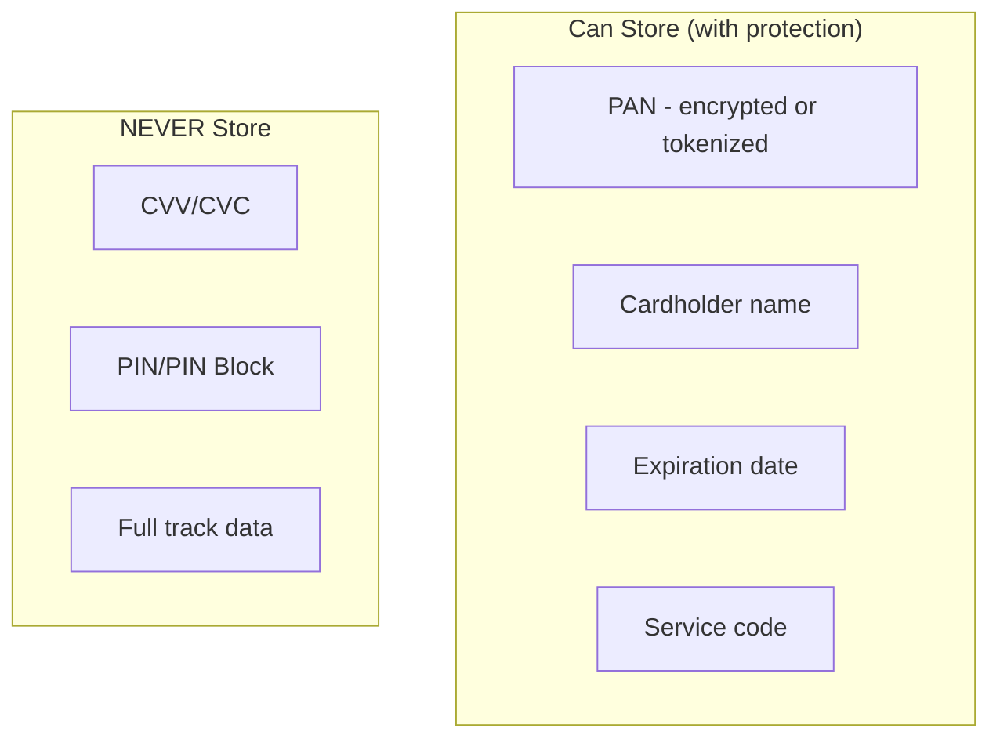
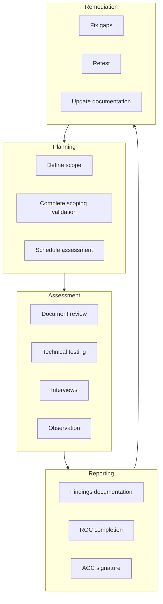

# PCI-DSS Requirements

> **Last Updated:** 2025-02-17
> **Status:** Complete

PCI-DSS contains 12 high-level requirements organized into 6 control objectives. Understanding these requirements is essential for building and maintaining compliant payment systems.

## Quick Reference

| Category | Requirements | Focus Area |
|----------|--------------|------------|
| Build Secure Network | 1-2 | Network controls, configurations |
| Protect Cardholder Data | 3-4 | Data storage, transmission |
| Vulnerability Management | 5-6 | Malware, secure development |
| Access Control | 7-9 | Authentication, physical security |
| Monitoring & Testing | 10-11 | Logging, vulnerability testing |
| Security Policy | 12 | Policies and procedures |

## The 12 Requirements

### Requirement 1: Network Security Controls

**Install and maintain network security controls**

| Sub-Requirement | Description |
|-----------------|-------------|
| 1.1 | Define and implement network security policies |
| 1.2 | Configure network controls to restrict traffic |
| 1.3 | Control network connections to/from CDE |
| 1.4 | Control traffic within CDE and connected systems |
| 1.5 | Document and manage all firewall rules |

**Key Implementation:**
- Firewall between internet and CDE
- Firewall between internal network and CDE
- Personal firewall on all devices connecting to CDE

### Requirement 2: Secure Configurations

**Apply secure configurations to all system components**

| Sub-Requirement | Description |
|-----------------|-------------|
| 2.1 | Change vendor defaults and remove unnecessary defaults |
| 2.2 | Develop and implement configuration standards |
| 2.3 | Encrypt all non-console admin access |

**Key Implementation:**
- Configuration standards for all system types
- No vendor-default passwords
- Disabled unnecessary services and protocols

### Requirement 3: Protect Stored Data

**Protect stored account data**

| Sub-Requirement | Description |
|-----------------|-------------|
| 3.1 | Keep cardholder data storage to a minimum |
| 3.2 | Do not store sensitive authentication data after authorization |
| 3.3 | Mask PAN when displayed |
| 3.4 | Render PAN unreadable when stored |
| 3.5 | Protect all keys used to secure stored data |
| 3.6 | Document key management procedures |
| 3.7 | Use strong cryptography key management |

**Critical:** Never store CVV, PIN, or full magnetic stripe data after authorization.

### Requirement 4: Protect Data in Transit

**Protect cardholder data with strong cryptography during transmission**

| Sub-Requirement | Description |
|-----------------|-------------|
| 4.1 | Protect cardholder data over open public networks |
| 4.2 | Protect PAN during transmission with strong cryptography |

**Key Implementation:**
- TLS 1.2 or higher for all cardholder data transmission
- No PAN in unencrypted channels (email, IM, SMS)
- Certificate validation and management

### Requirement 5: Malware Protection

**Protect all systems and networks from malware**

| Sub-Requirement | Description |
|-----------------|-------------|
| 5.1 | Deploy anti-malware on all systems |
| 5.2 | Ensure malware mechanisms are maintained |
| 5.3 | Enable anti-malware on all removable media |
| 5.4 | Implement anti-phishing mechanisms |

### Requirement 6: Secure Development

**Develop and maintain secure systems and software**

| Sub-Requirement | Description |
|-----------------|-------------|
| 6.1 | Identify and manage security vulnerabilities |
| 6.2 | Develop software securely |
| 6.3 | Identify and address security vulnerabilities |
| 6.4 | Protect public-facing web applications |
| 6.5 | Change management for all system components |

**Key v4.0 Changes:**

| Requirement | New in v4.0 | Impact |
|-------------|-------------|--------|
| **6.4.3** | Inventory all scripts on payment pages | Track JavaScript |
| **11.6.1** | Detect unauthorized page changes | Monitor for tampering |

### Requirement 7: Restrict Access by Need-to-Know

**Restrict access to system components and cardholder data**

| Sub-Requirement | Description |
|-----------------|-------------|
| 7.1 | Define access control policies |
| 7.2 | Implement least privilege |
| 7.3 | Access control via managed access control system |

**Key Implementation:**
- Role-based access control (RBAC)
- Default deny all access
- Document and approve all access grants

### Requirement 8: Identify and Authenticate

**Identify users and authenticate access to system components**

| Sub-Requirement | Description |
|-----------------|-------------|
| 8.1 | Manage user identification and assignment |
| 8.2 | Use unique user IDs |
| 8.3 | Implement strong authentication |
| 8.4 | Implement MFA for access to CDE |
| 8.5 | Manage use of system/application accounts |
| 8.6 | Maintain strict authentication controls |

**Key v4.0 Changes:**

| Requirement | v4.0 Change | Previous |
|-------------|-------------|----------|
| **8.3.6** | Minimum 12 characters | 7 characters |
| **8.4.2** | MFA for ALL CDE access | Admin only |

### Requirement 9: Physical Security

**Restrict physical access to cardholder data**

| Sub-Requirement | Description |
|-----------------|-------------|
| 9.1 | Implement physical access controls |
| 9.2 | Manage entry to sensitive areas |
| 9.3 | Control physical access to network jacks |
| 9.4 | Control visitor physical access |
| 9.5 | Protect POI devices from tampering |

### Requirement 10: Logging and Monitoring

**Log and monitor all access to system components and cardholder data**

| Sub-Requirement | Description |
|-----------------|-------------|
| 10.1 | Implement audit trails |
| 10.2 | Implement automated audit trails for all system components |
| 10.3 | Record audit trail entries for all events |
| 10.4 | Synchronize system clocks |
| 10.5 | Secure audit logs |
| 10.6 | Review logs and security events |
| 10.7 | Retain audit log history |

**Log Retention:**
- Online: Minimum 3 months immediately available
- Archive: Minimum 12 months total retention

### Requirement 11: Security Testing

**Test security of systems and networks regularly**

| Sub-Requirement | Description |
|-----------------|-------------|
| 11.1 | Test for unauthorized wireless access points |
| 11.2 | Identify and manage security vulnerabilities |
| 11.3 | Perform external and internal penetration testing |
| 11.4 | Implement intrusion detection/prevention |
| 11.5 | Deploy change detection mechanisms |
| 11.6 | Detect unauthorized changes to web pages |

**Testing Schedule:**

| Test Type | Frequency | Performed By |
|-----------|-----------|--------------|
| External vulnerability scan | Quarterly | ASV |
| Internal vulnerability scan | Quarterly | Internal or external |
| External penetration test | Annually | Qualified tester |
| Internal penetration test | Annually | Qualified tester |
| Segmentation validation | Annually (Level 1: every 6 months) | Qualified tester |

### Requirement 12: Security Policies

**Support information security with organizational policies and programs**

| Sub-Requirement | Description |
|-----------------|-------------|
| 12.1 | Information security policy is established |
| 12.2 | Acceptable use policies are implemented |
| 12.3 | Targeted risk analysis is performed |
| 12.4 | PCI DSS responsibilities are clearly defined |
| 12.5 | PCI DSS scope is documented and confirmed |
| 12.6 | Security awareness education is implemented |
| 12.7 | Screen personnel before hire |
| 12.8 | Service provider compliance is managed |
| 12.9 | Service providers acknowledge responsibilities |
| 12.10 | Incident response plan is implemented |

## Service Provider-Specific Requirements

Service providers (including PayFacs) have additional obligations:

| Requirement | Service Provider Specific |
|-------------|--------------------------|
| 3.6.1.1 | Additional key management for service providers |
| 8.3.10 | Service provider passwords changed at least every 90 days |
| 12.4.1 | Executive management quarterly PCI responsibility review |
| 12.8.4 | Annual compliance status monitoring of service providers |
| 12.9.1 | Service providers must provide written acknowledgment |

## SAQ Types

Self-Assessment Questionnaires vary by merchant type:

| SAQ | Merchant Type | Question Count |
|-----|---------------|----------------|
| A | Card-not-present, fully outsourced | 31 |
| A-EP | E-commerce, outsourced to validated SP | 42 |
| B | Imprint or standalone terminals | 27 |
| B-IP | Standalone IP-connected terminals | 36 |
| C-VT | Web-based virtual terminal | 28 |
| C | Internet-connected payment systems | 46 |
| P2PE | Validated P2PE solution | 33 |
| **D** | All others / Service Providers | **251** (merchants) / **269** (SP) |

## Compliance Assessment Process

## Common Compliance Gaps

| Requirement | Common Gap | Resolution |
|-------------|------------|------------|
| 1 | Incomplete network diagrams | Document all CDE connections |
| 3 | Storing CVV in logs | Mask/truncate all logging |
| 6 | No script inventory | Implement CSP and monitoring |
| 8 | Shared accounts | Enforce unique IDs |
| 10 | Incomplete logging | Enable all required log events |
| 11 | Missing quarterly scans | Schedule and track all scans |
| 12 | Outdated policies | Annual policy review |

## Related Topics

- [Scope Management](./scope-management.md) - Reducing compliance scope
- [Tokenization](./tokenization.md) - Data protection strategies
- [Incident Response](../incident-response/index.md) - Breach handling

## References

- [PCI DSS v4.0.1 Standard](https://www.pcisecuritystandards.org/document_library/)
- [PCI DSS Quick Reference Guide](https://www.pcisecuritystandards.org/document_library/)
- [PCI SSC Guidance Documents](https://www.pcisecuritystandards.org/document_library/)
