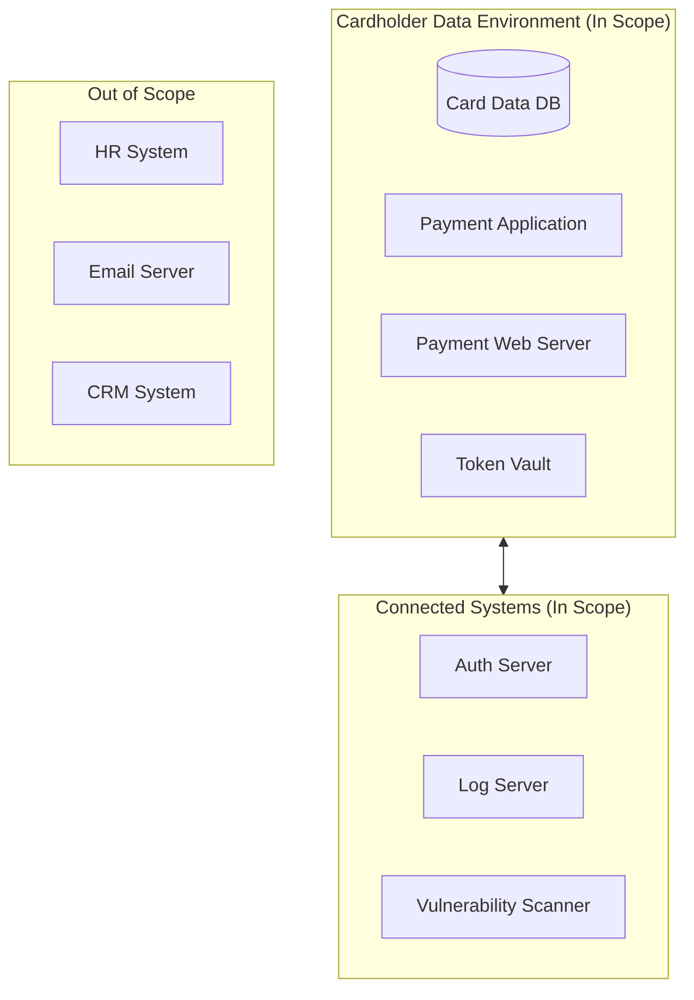
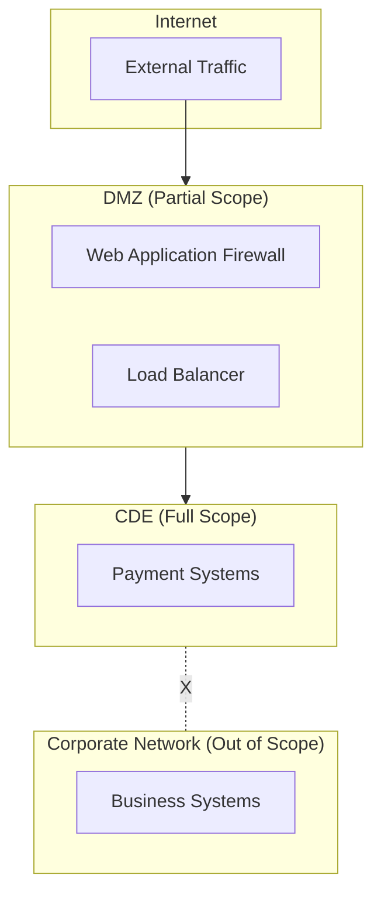
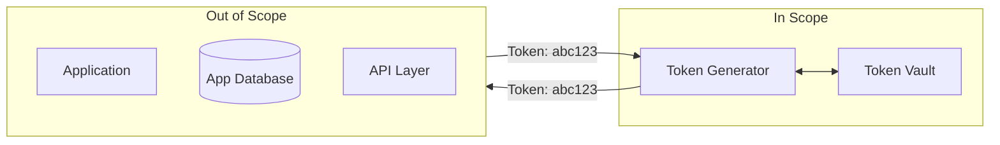
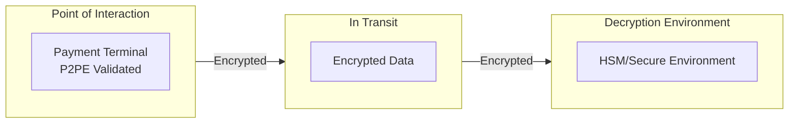
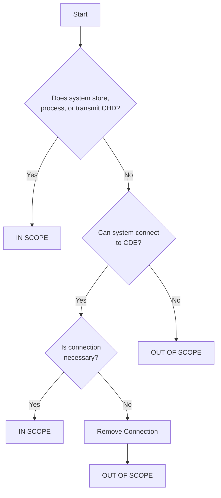
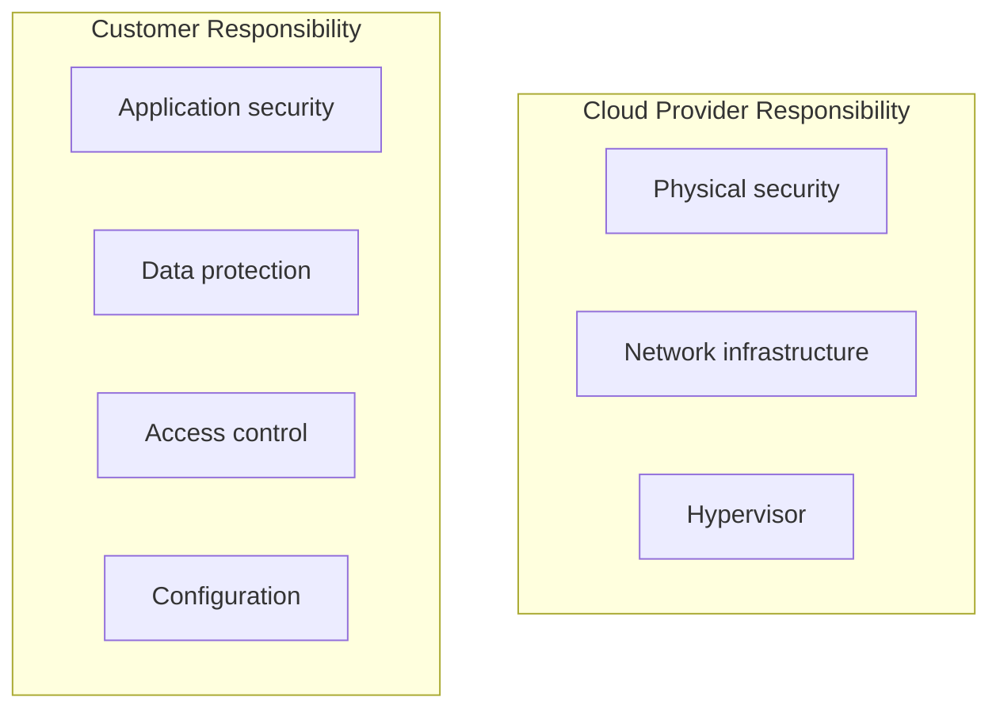

# PCI Scope Management

> **Last Updated:** 2025-02-17
> **Status:** Complete

Scope management is critical for efficient PCI compliance. The Cardholder Data Environment (CDE) and all connected systems are "in scope" and must meet PCI-DSS requirements. Reducing scope lowers compliance cost and risk.

## Quick Reference

| Term | Definition |
|------|------------|
| CDE | Systems that store, process, or transmit cardholder data |
| In Scope | Systems that must meet PCI requirements |
| Connected Systems | Systems that can communicate with CDE |
| Out of Scope | Systems with no access to CDE |

## Cardholder Data Environment (CDE)

The CDE comprises all system components involved in handling cardholder data:

### What's In Scope

| Category | Examples | Why In Scope |
|----------|----------|--------------|
| **Direct Systems** | Payment gateway, card database | Store/process/transmit CHD |
| **Connected Systems** | Auth servers, logging systems | Can access CDE |
| **Security Systems** | Firewalls, IDS/IPS | Protect CDE |
| **Admin Systems** | Jump hosts, management consoles | Access to CDE |

### v4.0 Scope Expansion

PCI DSS v4.0 expanded scope to include client-side components:

| Requirement | New Scope |
|-------------|-----------|
| 6.4.3 | All scripts on payment pages |
| 11.6.1 | Client-side script monitoring |

This means JavaScript and third-party trackers on payment pages are now in scope.

## Scope Reduction Strategies

### Strategy 1: Network Segmentation

Isolate the CDE from other networks to limit scope:

**Segmentation Requirements:**
- No direct communication between CDE and out-of-scope systems
- Firewalls/ACLs enforcing segmentation
- Annual validation by QSA
- Level 1 service providers: validation every 6 months

### Strategy 2: Tokenization

Replace cardholder data with tokens to move systems out of scope:

**Tokenization Impact:**
- Systems handling only tokens are OUT of scope
- Token vault and generation remain IN scope
- Significantly reduces compliance footprint

Learn more: [Tokenization](./tokenization.md)

### Strategy 3: P2PE (Point-to-Point Encryption)

Encrypt data at the point of interaction, keeping it encrypted until secure decryption:

**P2PE Impact:**
- Merchant systems that only pass encrypted data are reduced scope
- SAQ P2PE has only 33 questions vs. 251+ for SAQ D
- Must use PCI-validated P2PE solution

### Strategy 4: Outsourcing

Move cardholder data handling to a compliant third party:

| Approach | Scope Impact | Requirements |
|----------|--------------|--------------|
| Hosted payment page | Out of scope | Validate provider compliance |
| Payment gateway | Out of scope | Validate provider compliance |
| Tokenization service | Out of scope | Validate provider compliance |

## Determining Scope

### Scope Assessment Process

### Scope Documentation Requirements

| Document | Purpose | Frequency |
|----------|---------|-----------|
| Network diagram | Show all CDE connections | Continuous update |
| Data flow diagram | Show cardholder data movement | Annual review |
| System inventory | List all in-scope systems | Continuous update |
| Scope validation | Confirm scope is accurate | Annual (QSA review) |

## Connected System Categories

### Category 1: Security Systems

Systems that provide security for the CDE:

| System Type | Why In Scope | Example |
|-------------|--------------|---------|
| Firewalls | Control CDE traffic | Palo Alto, Cisco ASA |
| IDS/IPS | Monitor CDE | Snort, Suricata |
| SIEM | Log CDE events | Splunk, ELK |
| Vulnerability scanners | Test CDE | Qualys, Tenable |

### Category 2: Administrative Systems

Systems used to manage the CDE:

| System Type | Why In Scope | Mitigation |
|-------------|--------------|------------|
| Jump hosts | Access CDE systems | Dedicated, hardened |
| AD/LDAP | Authenticate CDE users | Segment or use dedicated |
| Configuration management | Deploy to CDE | Dedicated tooling |

### Category 3: Supporting Systems

Systems that could impact CDE security:

| System Type | Why In Scope | Alternative |
|-------------|--------------|-------------|
| DNS | Resolve CDE hostnames | Use dedicated DNS |
| NTP | Sync CDE clocks | Dedicated NTP |
| DHCP | Assign CDE IPs | Static IPs in CDE |

## Common Scope Mistakes

| Mistake | Impact | Solution |
|---------|--------|----------|
| No segmentation | Everything in scope | Implement network isolation |
| Flat network | Lateral movement possible | Segment by function |
| Shared credentials | Admin systems in scope | Dedicated CDE accounts |
| Logging to shared SIEM | SIEM in scope | Dedicated security logging |
| Backup to shared system | Backup system in scope | Dedicated CDE backup |
| Cloud confusion | Unclear shared responsibility | Document cloud boundaries |

## Cloud Scope Considerations

### Shared Responsibility Model

### Cloud Scope by Service Model

| Model | Provider Scope | Customer Scope |
|-------|---------------|----------------|
| IaaS | Infrastructure | OS, apps, data |
| PaaS | Infrastructure + platform | Apps, data |
| SaaS | Everything | Data handling |

## Scope Reduction ROI

### Cost Comparison

| Metric | Full Scope (100 systems) | Reduced Scope (10 systems) |
|--------|-------------------------|---------------------------|
| Annual assessment | $150,000-250,000 | $50,000-75,000 |
| Remediation | $100,000-500,000 | $25,000-75,000 |
| Ongoing maintenance | $200,000-400,000/year | $50,000-100,000/year |
| Breach exposure | Very high | Contained |

### Implementation Investment

| Strategy | Implementation Cost | Annual Savings |
|----------|---------------------|----------------|
| Segmentation | $50,000-150,000 | $100,000-300,000 |
| Tokenization | $100,000-300,000 | $150,000-400,000 |
| P2PE | $25,000-100,000 | $100,000-200,000 |

## Scope Validation Process

### Annual Validation

| Step | Activity | Documentation |
|------|----------|---------------|
| 1 | Review network diagrams | Updated diagrams |
| 2 | Verify segmentation controls | Firewall rule review |
| 3 | Validate data flows | Data flow diagrams |
| 4 | Test segmentation effectiveness | Penetration test results |
| 5 | Document scope determination | Scope statement |

### QSA Scope Review

| Area | QSA Validation |
|------|----------------|
| Network architecture | Review diagrams, verify controls |
| System inventory | Confirm all in-scope systems |
| Data flows | Verify CHD paths |
| Segmentation | Test control effectiveness |
| Third parties | Validate provider compliance |

## Related Topics

- [Tokenization](./tokenization.md) - Token-based scope reduction
- [Requirements](./requirements.md) - What in-scope systems must do
- [Incident Response](../incident-response/index.md) - CDE breach handling

## References

- [PCI DSS Scoping and Network Segmentation Guide](https://www.pcisecuritystandards.org/document_library/)
- [PCI DSS Cloud Computing Guidelines](https://www.pcisecuritystandards.org/document_library/)
