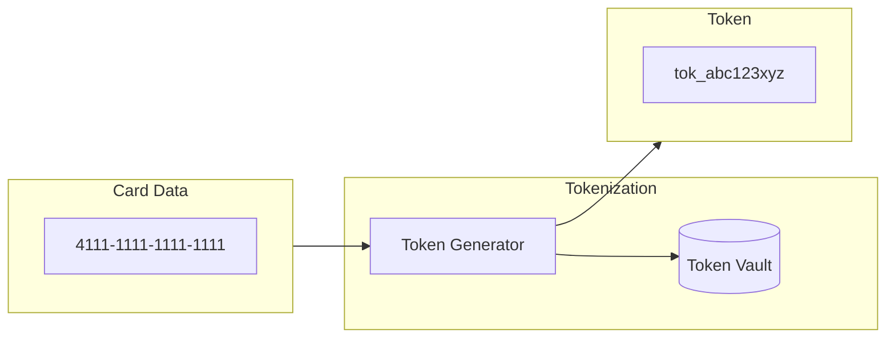
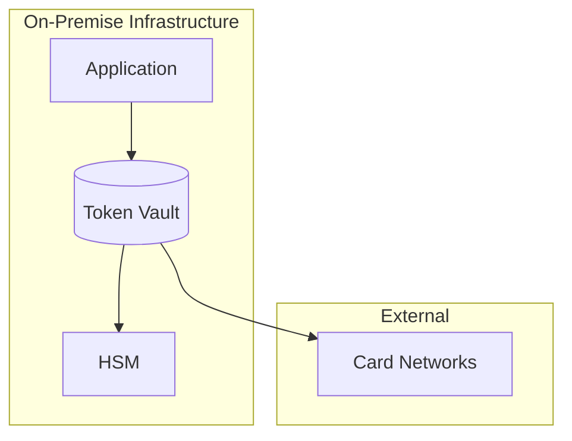
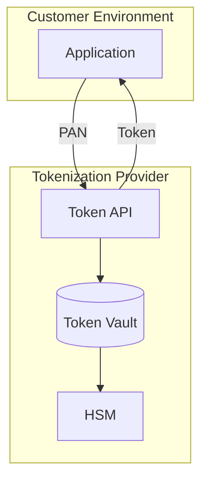
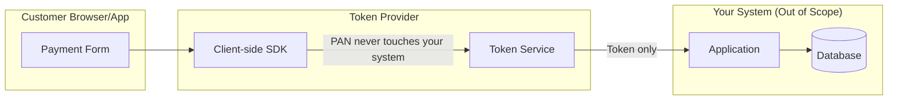
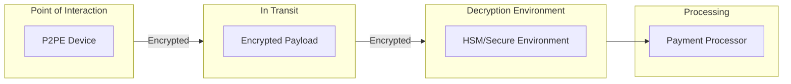
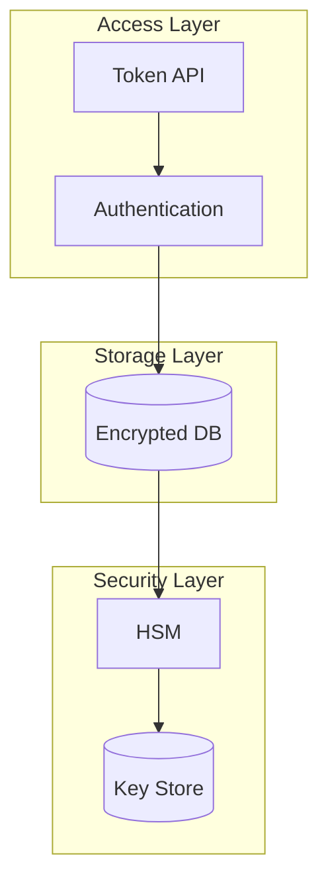
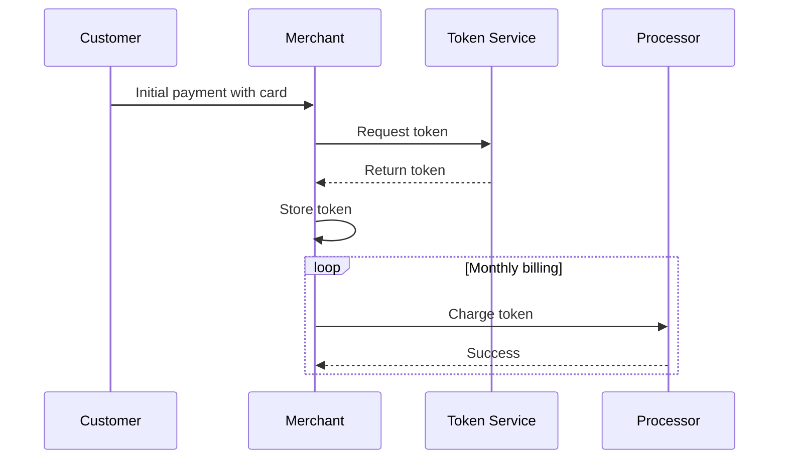
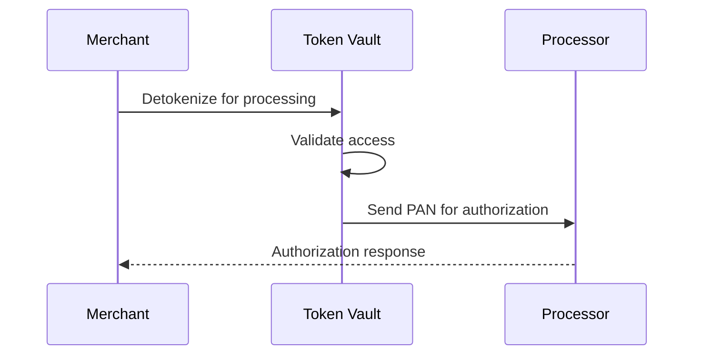

# Tokenization & P2PE

> **Last Updated:** 2025-02-17
> **Status:** Complete

Tokenization and Point-to-Point Encryption (P2PE) are powerful strategies for reducing PCI scope. By replacing cardholder data with tokens or encrypting it at the point of capture, systems handling payment data can be moved out of scope.

## Quick Reference

| Strategy | Scope Impact | Implementation |
|----------|--------------|----------------|
| Tokenization | Systems with tokens only = out of scope | Token vault in scope |
| P2PE | SAQ P2PE (33 questions) | Validated solution required |
| Combined | Maximum reduction | Both strategies together |

## What is Tokenization?

Tokenization replaces sensitive cardholder data with a non-sensitive token that has no exploitable value.

### Token vs. Original Data

| Aspect | Original PAN | Token |
|--------|--------------|-------|
| Contains card data | Yes | No |
| Exploitable if stolen | Yes | No |
| PCI scope | Full requirements | Out of scope |
| Reversible | N/A | Only with vault access |

## Token Types

### Format-Preserving Tokens

Tokens that maintain the format of the original data:

| Original PAN | Format-Preserving Token |
|--------------|-------------------------|
| 4111111111111111 | 9876543210987654 |
| 5500000000000004 | 1234567890123456 |

**Use Cases:**
- Legacy systems requiring numeric format
- Systems with fixed field lengths
- Display purposes (last 4 visible)

### Random Tokens

Tokens with no relationship to original format:

| Original PAN | Random Token |
|--------------|--------------|
| 4111111111111111 | tok_a1b2c3d4e5f6 |
| 5500000000000004 | cus_xyz789abc123 |

**Use Cases:**
- Modern systems
- API integrations
- Maximum security

## Tokenization Architecture

### On-Premise Tokenization

| Aspect | Consideration |
|--------|---------------|
| Control | Full control |
| Compliance | Vault and HSM in scope |
| Cost | High infrastructure cost |
| Flexibility | Maximum customization |

### Cloud Tokenization

| Aspect | Consideration |
|--------|---------------|
| Control | Provider managed |
| Compliance | Provider maintains compliance |
| Cost | Lower, usage-based |
| Flexibility | Limited to provider capabilities |

### Optimal Architecture

Best practice: Tokenize before data enters your environment:

**Benefit:** Card data never enters your systems = maximum scope reduction.

## P2PE (Point-to-Point Encryption)

P2PE encrypts cardholder data at the point of interaction and keeps it encrypted until it reaches a secure decryption environment.

### P2PE Architecture

### P2PE Requirements

| Component | Requirement |
|-----------|-------------|
| Device | PCI PTS POI validated |
| Application | P2PE validated application |
| Encryption | TDES or AES |
| Key management | Per PCI P2PE standard |
| Decryption | Only in HSM environment |

### P2PE Benefits

| Benefit | Impact |
|---------|--------|
| Scope reduction | SAQ P2PE (33 questions) vs. SAQ D (251+) |
| Data protection | Encrypted end-to-end |
| Merchant liability | Reduced responsibility |
| Compliance cost | Significantly lower |

### P2PE Validation Status

| Standard | Current Version | Revalidation |
|----------|-----------------|--------------|
| P2PE | v3.1 | Every 3 years |

## Token Vault Security

### Vault Requirements

| Requirement | Implementation |
|-------------|----------------|
| Encryption | AES-256 for stored data |
| Access control | Role-based, need-to-know |
| Key management | HSM-protected keys |
| Audit logging | All access logged |
| Backup | Encrypted, secure storage |

### Vault Architecture

## Implementation Strategies

### Strategy 1: Full Tokenization

Replace all PANs with tokens throughout your systems:

| Phase | Action |
|-------|--------|
| 1 | Deploy token vault infrastructure |
| 2 | Integrate tokenization APIs |
| 3 | Migrate existing stored PANs |
| 4 | Update data flows to use tokens |
| 5 | Remove original PANs |

### Strategy 2: Payment Page Tokenization

Tokenize at the payment form level:

| Phase | Action |
|-------|--------|
| 1 | Integrate hosted payment fields or client-side SDK |
| 2 | Accept tokens from checkout |
| 3 | Store tokens, never PANs |
| 4 | Process with tokens only |

### Strategy 3: P2PE for Card-Present

Implement P2PE for in-person transactions:

| Phase | Action |
|-------|--------|
| 1 | Select PCI-validated P2PE solution |
| 2 | Deploy P2PE terminals |
| 3 | Configure encrypted data flow |
| 4 | Validate scope reduction |

## Token Use Cases

### Recurring Billing

### Card-on-File

| Use Case | Token Benefit |
|----------|---------------|
| E-commerce checkout | Stored payment method, no PAN storage |
| Subscription services | Recurring charges without re-entering card |
| Mobile wallets | Secure card representation |

## Detokenization

When needed, tokens can be converted back to PANs:

| Scenario | Detokenization Needed |
|----------|----------------------|
| Authorization | Yes (by processor) |
| Refund | Yes (by processor) |
| Reporting | Usually no (use masked data) |
| Customer display | No (use token or mask) |

### Detokenization Flow

## Compliance Considerations

### In-Scope vs. Out-of-Scope

| Component | Scope Status |
|-----------|--------------|
| Token vault | IN scope |
| Token generation | IN scope |
| Systems with tokens only | **OUT of scope** |
| HSM/key management | IN scope |
| P2PE terminals | IN scope (reduced validation) |
| Systems passing encrypted data | OUT of scope |

### Validation Requirements

| Entity | Validation Needed |
|--------|-------------------|
| Token vault operator | Full PCI DSS |
| P2PE solution provider | P2PE validation |
| Merchant using P2PE | SAQ P2PE |
| Merchant using tokens only | Potentially SAQ A |

## Related Topics

- [Scope Management](./scope-management.md) - Overall scope strategies
- [Requirements](./requirements.md) - PCI requirements for in-scope systems
- [Fraud Prevention](../fraud-prevention/index.md) - Token security benefits

## References

- [PCI Tokenization Guidelines](https://www.pcisecuritystandards.org/document_library/)
- [PCI P2PE Standard](https://www.pcisecuritystandards.org/document_library/)
- [PCI SSC Token Service Provider Program](https://www.pcisecuritystandards.org/)
