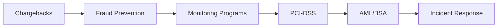

# Risk & Compliance Study Guide

> **Last Updated:** 2025-02-17
> **Status:** Complete

Use this study guide to systematically master risk and compliance concepts for payment platforms.

## Quick Reference

| Resource | Purpose |
|----------|---------|
| **[Topics](./topics.md)** | Comprehensive checklist of concepts to learn |
| **[Questions](./questions.md)** | 41 self-assessment questions |
| **[Resources](./resources.md)** | Curated reading materials |

## How to Use This Guide

### Step 1: Review the Topics

Start with the [Topics](./topics.md) page to understand what you need to learn. Use it as a checklist to track your progress through:

- Chargeback fundamentals and reason codes
- Fraud patterns and prevention tools
- Network monitoring programs (VAMP, ECP, EFM)
- PCI-DSS requirements and scope management
- AML/BSA compliance
- Incident response procedures

### Step 2: Study the Content

Work through each section of the Risk & Compliance module:

### Step 3: Test Yourself

Use the [Questions](./questions.md) page to validate your understanding. Questions cover:

- Chargeback management (Questions 1-5, 21, 24)
- Fraud prevention (Questions 6-10, 25)
- Monitoring programs (Questions 27-36)
- PCI-DSS (Questions 11-16, 23, 26)
- AML/BSA (Questions 17-20, 22)
- Incident response (Questions 37-41)

### Step 4: Deep Dive with Resources

Use the [Resources](./resources.md) page to explore primary sources:

- Card network documentation (Visa, Mastercard)
- PCI Security Standards Council
- FinCEN and FFIEC guidance
- Industry publications and tools

## Completion Checklist

After completing this module, you should be able to:

- [ ] Navigate a chargeback from receipt through arbitration
- [ ] Calculate and manage chargeback ratios
- [ ] Identify reason codes and evidence requirements
- [ ] Design a transaction monitoring system
- [ ] Explain VAMP, ECP, EFM program thresholds
- [ ] Describe 3DS2 and liability shift
- [ ] Explain PCI-DSS scope and reduce it architecturally
- [ ] Identify SAR-triggering patterns
- [ ] Describe the three stages of money laundering
- [ ] Execute breach notification within required timelines

## Section Contents

- **[Topics](./topics.md)** - Comprehensive topic checklist
- **[Questions](./questions.md)** - 41 self-assessment questions
- **[Resources](./resources.md)** - Reading materials and references

## Related Topics

- [Chargebacks](../chargebacks/index.md) - Dispute management
- [Fraud Prevention](../fraud-prevention/index.md) - Detection and prevention
- [Monitoring Programs](../monitoring-programs/index.md) - Network compliance
- [PCI Compliance](../pci-compliance/index.md) - Data security
- [AML/BSA](../aml-bsa/index.md) - Regulatory compliance
- [Incident Response](../incident-response/index.md) - Breach handling
